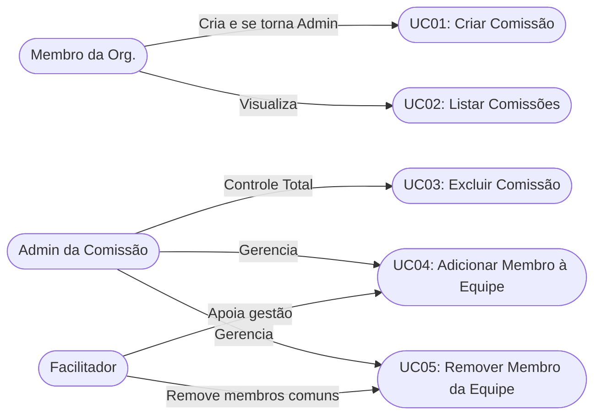

# Alteração de dados pessoais

## Descrição

O Módulo de Comissões permite a estruturação de grupos de trabalho dentro do BetterMeet. Ele abrange a criação de novas comissões vinculadas a uma organização existente, a visualização e exclusão desses grupos, e a gestão detalhada da equipe de trabalho (adicionar e remover usuários). A gestão da equipe é governada por um sistema de permissões baseado em papéis (ADMINISTRADOR, FACILITADOR, SECRETARIO e MEMBRO), garantindo que apenas membros autorizados possam alterar a estrutura da comissão.

## Autores

Membro da Organização, Administrador da Comissão, facilitador da Comissão e Administrador do sistema

## Pré-condição

O usuário deve estar devidamente autenticado no sistema via token JWT seguro (cabeçalho Authorization: Bearer).

A Organização à qual a comissão pertence deve estar obrigatoriamente com o status de aprovação "ACEITA".

O usuário que tenta criar a comissão ou ser adicionado a ela precisa obrigatoriamente fazer parte do quadro de membros da Organização.

Para gerenciar membros (adicionar/remover) ou excluir a comissão, o usuário logado precisa ter o papel de ADMINISTRADOR ou FACILITADOR na tabela de equipe da respectiva comissão.

## Pós-condição

Na criação (UC01): O registro da comissão é salvo no banco de dados e o usuário criador é automaticamente inserido na equipe com o papel intransferível de ADMINISTRADOR.

Na exclusão (UC02): A comissão e todos os vínculos de equipe associados a ela são removidos permanentemente do banco de dados (efeito cascata).

Na gestão de equipe (UC03): O quadro de membros da comissão é atualizado. O sistema garante a integridade da comissão impedindo que ela fique sem pelo menos um ADMINISTRADOR e impedindo que um FACILITADOR remova ou adicione um ADMINISTRADOR.
## Diagrama Geral de Casos de Uso

