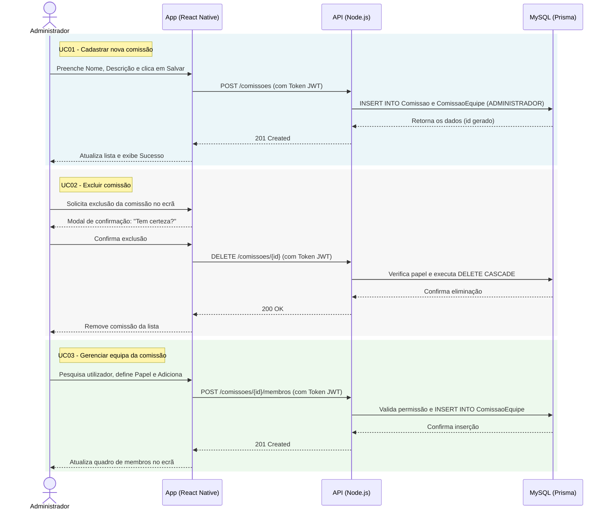

```mermaid
sequenceDiagram
    actor Admin as Administrador
    participant App as App (React Native)
    participant API as API (Node.js)
    participant DB as MySQL (Prisma)

    %% UC01: Cadastrar
    rect rgba(190, 225, 235, 0.3)
    Note right of Admin: UC01 - Cadastrar nova comissão
    Admin->>App: Preenche Nome, Descrição e clica em Salvar
    App->>API: POST /comissoes (com Token JWT)
    API->>DB: INSERT INTO Comissao e ComissaoEquipe (ADMINISTRADOR)
    DB-->>API: Retorna os dados (id gerado)
    API-->>App: 201 Created
    App-->>Admin: Atualiza lista e exibe Sucesso
    end

    %% UC02: Gerenciar (Exemplo: Exclusão)
    rect rgba(240, 240, 240, 0.5)
    Note right of Admin: UC02 - Excluir comissão
    Admin->>App: Solicita exclusão da comissão no ecrã
    App-->>Admin: Modal de confirmação: "Tem certeza?"
    Admin->>App: Confirma exclusão
    App->>API: DELETE /comissoes/{id} (com Token JWT)
    API->>DB: Verifica papel e executa DELETE CASCADE
    DB-->>API: Confirma eliminação
    API-->>App: 200 OK
    App-->>Admin: Remove comissão da lista
    end

    %% UC03: Gerenciar Equipa
    rect rgba(195, 235, 195, 0.3)
    Note right of Admin: UC03 - Gerenciar equipa da comissão
    Admin->>App: Pesquisa utilizador, define Papel e Adiciona
    App->>API: POST /comissoes/{id}/membros (com Token JWT)
    API->>DB: Valida permissão e INSERT INTO ComissaoEquipe
    DB-->>API: Confirma inserção
    API-->>App: 201 Created
    App-->>Admin: Atualiza quadro de membros no ecrã
    end
```
