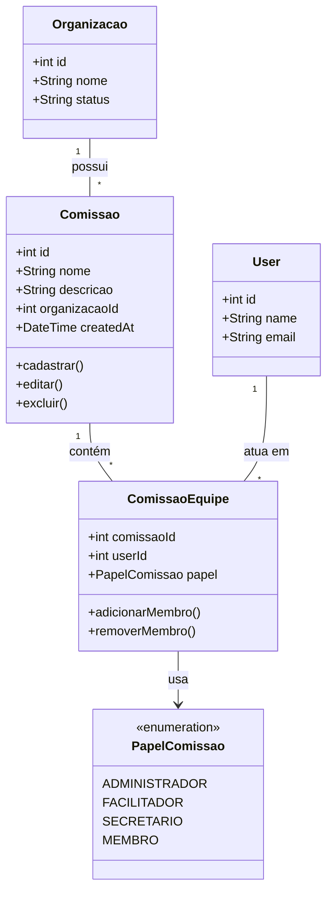

```mermaid
classDiagram
    class PapelComissao {
        <<enumeration>>
        ADMINISTRADOR
        FACILITADOR
        SECRETARIO
        MEMBRO
    }

    class Organizacao {
        +int id
        +String nome
        +String status
    }
    class Comissao {
        +int id
        +String nome
        +String descricao
        +int organizacaoId
        +DateTime createdAt
        +cadastrar()
        +editar()
        +excluir()
    }
    class User {
        +int id
        +String name
        +String email
    }
    class ComissaoEquipe {
        +int comissaoId
        +int userId
        +PapelComissao papel
        +adicionarMembro()
        +removerMembro()
    }

    Organizacao "1" -- "*" Comissao : possui
    Comissao "1" -- "*" ComissaoEquipe : contém
    User "1" -- "*" ComissaoEquipe : atua em
    ComissaoEquipe --> PapelComissao : usa
```
