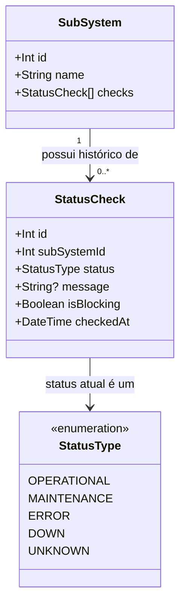
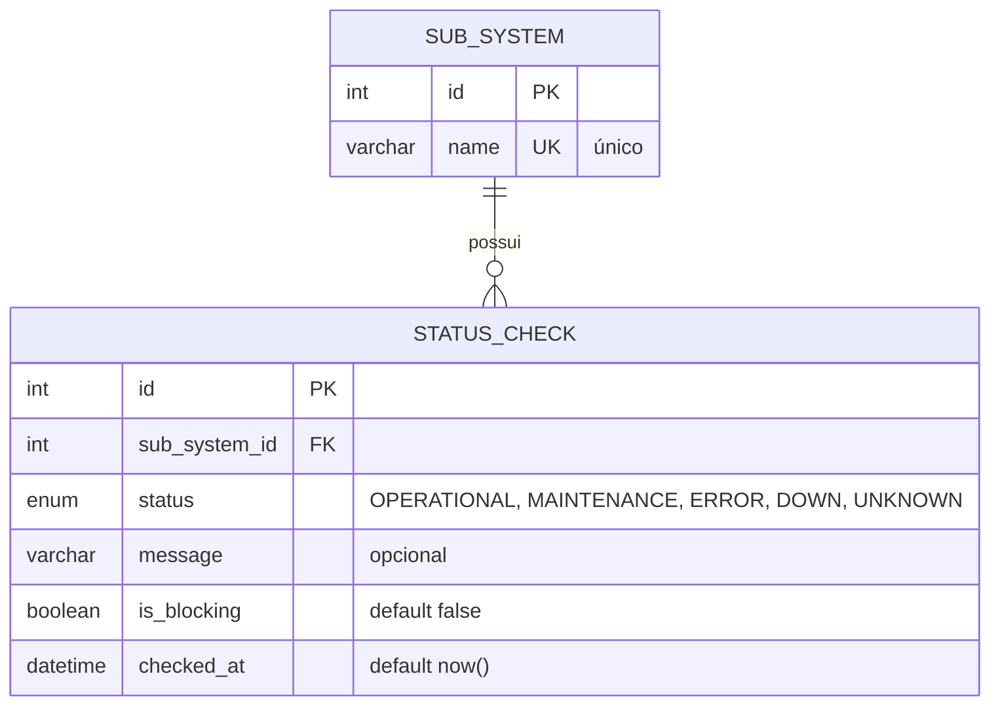
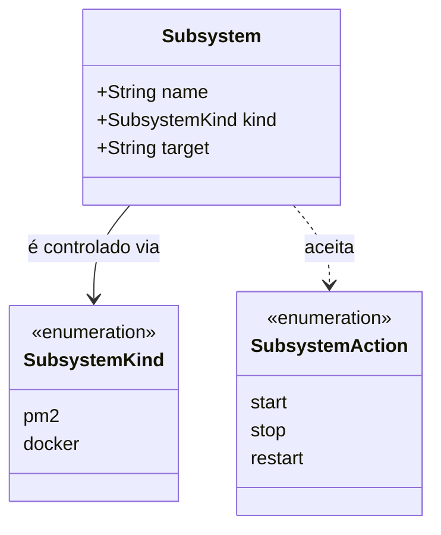
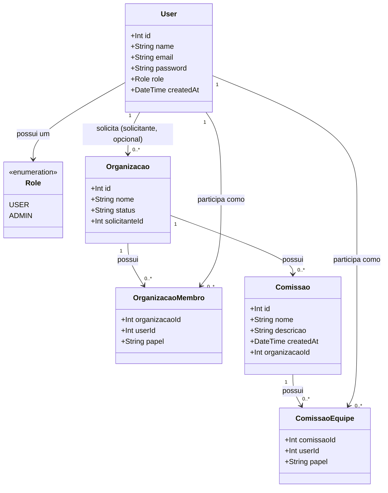
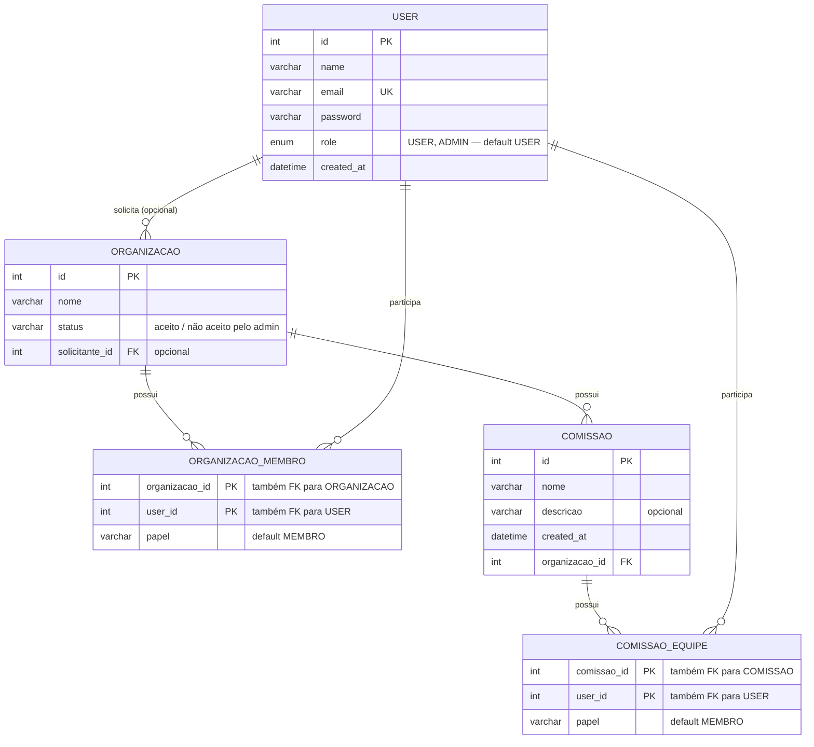
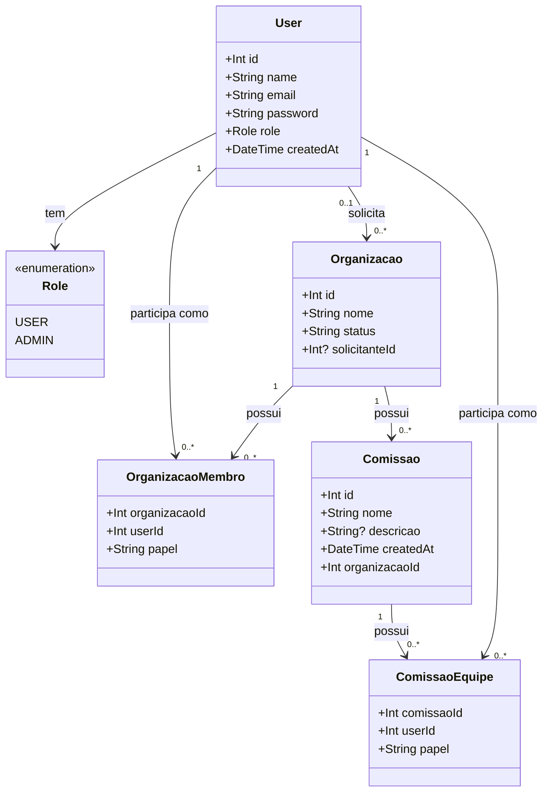
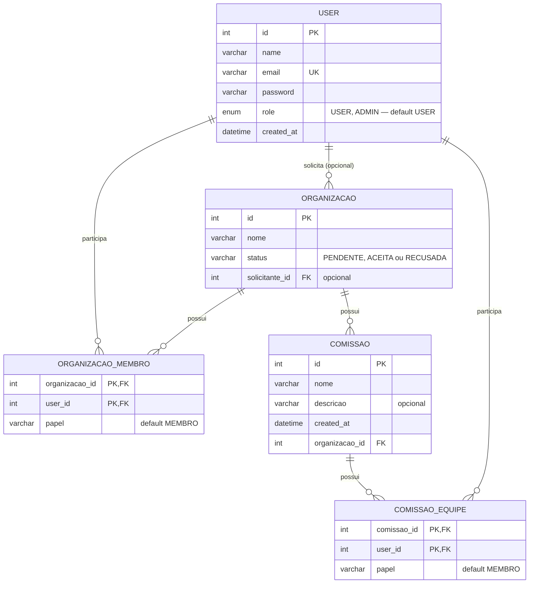

# Diagrama de Classes, Diagrama Relacional e Dicionário de Dados — Entrega Di1

> Este arquivo é organizado por requisito. Cada seção `##` abaixo corresponde a um requisito do Incremento 1 e é de responsabilidade do membro da equipe que o levantou.

---

## Informações do Sistema — Status do Sistema e dos Subsistemas (API de Monitoramento)

Modelo de dados da `monitoring-better-meet`, definido em `monitoring-better-meet/prisma/schema.prisma`. Duas entidades: `SubSystem` (um por sistema monitorado) e `StatusCheck` (um registro por checagem realizada, histórico imutável).

### Diagrama de Classes

### Diagrama Relacional (MySQL)

**Índice**: `StatusCheck(subSystemId, checkedAt)` — composto, criado para otimizar as consultas de relatório diário e histórico, que sempre filtram por subsistema e por intervalo de data.

**Regra de integridade**: `StatusCheck.subSystemId` tem `onDelete: Cascade` — se um `SubSystem` for removido, todo o histórico de checagens associado é removido junto (não há hoje um endpoint que remova `SubSystem`, mas a regra está definida no schema por segurança).

### Dicionário de Dados

#### Entidade: `SubSystem`

Representa um sistema monitorado. Criado automaticamente (*upsert*) na primeira vez que reporta um status — não há endpoint de cadastro manual.

| Atributo | Tipo | Tamanho / Domínio | Obrigatório | Chave | Descrição |
|---|---|---|---|---|---|
| `id` | Int | autoincrement | Sim | PK | Identificador único, gerado pelo banco |
| `name` | String (varchar) | livre, único | Sim | UK | Nome do subsistema. Valores em uso hoje: `database`, `data-api`, `mobile-app`, `monitoring-database`, `management`, `monitoring` |

#### Entidade: `StatusCheck`

Representa **uma checagem de status** de um `SubSystem`, em um instante específico. Cada checagem (automática pelo cron ou reportada por um serviço externo) gera um novo registro — a tabela nunca é atualizada (`UPDATE`), só recebe inserções, formando o histórico.

| Atributo | Tipo | Tamanho / Domínio | Obrigatório | Chave | Descrição |
|---|---|---|---|---|---|
| `id` | Int | autoincrement | Sim | PK | Identificador único da checagem |
| `subSystemId` | Int | — | Sim | FK → `SubSystem.id` | Subsistema ao qual essa checagem pertence |
| `status` | Enum (`StatusType`) | `OPERATIONAL`, `MAINTENANCE`, `ERROR`, `DOWN`, `UNKNOWN` | Sim | — | Resultado da checagem. Ver semântica abaixo |
| `message` | String (varchar) | livre | Não | — | Mensagem de contexto (ex.: mensagem de erro, motivo da manutenção) |
| `isBlocking` | Boolean | `true` / `false` | Sim (default `false`) | — | Diferencia um erro que impediu o usuário de completar uma ação essencial (`true`) de um erro genérico sem contexto (`false`) |
| `checkedAt` | DateTime | timestamp | Sim (default `now()`) | — | Data/hora em que a checagem foi realizada/registrada |

#### Domínio: `StatusType` (enum)

| Valor | Severidade | Significado |
|---|---|---|
| `DOWN` | 4 (mais grave) | Sistema indisponível de verdade — é o que o cron grava quando uma checagem automática falha (timeout, conexão recusada, etc.) |
| `ERROR` | 3 | Erro capturado, mas o sistema não está necessariamente indisponível (ex.: erro no app mobile reportado pelo próprio usuário) |
| `MAINTENANCE` | 2 | Sistema em manutenção programada |
| `UNKNOWN` | 1 | Status desconhecido (ex.: nenhuma checagem registrada ainda para aquele subsistema/dia) |
| `OPERATIONAL` | 0 (menos grave) | Sistema funcionando normalmente |

A severidade é usada para calcular o **"pior status do dia"** (`worstStatus`) nos relatórios de histórico — evita que um erro no meio do dia seja mascarado por um status bom registrado no fim do dia.

---

## Informações do Sistema — Reinicialização de Subsistemas e Setup Inicial (API de Gestão)

Diferente da `monitoring-better-meet`, a `management-better-meet` **não possui banco de dados próprio** (ver RNF12 em `requisitos_e_casos_de_uso.md`) — é uma camada de orquestração sem estado: autenticação é validada via JWT compartilhado com a Data API, e status é sempre delegado à API de Monitoramento. Por isso, **o diagrama relacional não se aplica aqui** — o que existe é uma estrutura fixa em memória (a whitelist de subsistemas controláveis, definida no código, não numa tabela).

### Diagrama de Classes (modelo de domínio)

### Diagrama Relacional

Não aplicável — sem banco de dados próprio (ver justificativa acima e RNF12).

### Dicionário de Dados (whitelist de subsistemas, em memória — `SUBSYSTEMS`)

| Nome (`:name`) | `kind` | `target` real | Descrição |
|---|---|---|---|
| `api` | `pm2` | `api` | Data API (Node/Express), processo PM2 |
| `monitoring` | `pm2` | `monitoring` | API de Monitoramento, processo PM2 |
| `management` | `pm2` (caso especial) | `management` | A própria API de Gestão — self-restart com resposta `202` antes do comando (UC09) |
| `database` | `docker` | `mysql_better_meet_dev` | Container MySQL da aplicação (porta 3306) |
| `monitoring-database` | `docker` | `mysql_monitoring_better_meet_dev` | Container MySQL da monitoring (porta 3307) |

### Domínio: `SubsystemAction` (enum)

| Valor | Efeito via PM2 | Efeito via Docker |
|---|---|---|
| `start` | `pm2.start(nome)` | `container.start()` |
| `stop` | `pm2.stop(nome)` | `container.stop()` |
| `restart` | `pm2.restart(nome)` | `container.restart()` |

---

## Cadastro de Organização, Comissão e Usuário — Modelo de Domínio (Data API)

> O diagrama de classes original desse requisito foi feito no Astah (`Diagrama de classes.asta`, na pasta de outro membro da equipe) — um formato binário proprietário (serialização de objetos Java), não um XML legível. Extraí o conteúdo por engenharia reversa do binário e **cruzei com o `api/prisma/schema.prisma` real** (fonte de verdade) pra garantir precisão. O schema real **já evoluiu além do desenho original do Astah**: existe hoje uma entidade `OrganizacaoMembro` e uma relação `solicitante` (o usuário que pediu a criação da organização) que não apareciam no diagrama antigo. O que está abaixo reflete o **código atual**, não o rascunho — é o que a entrega exige ("código de acordo com a documentação").

### Diagrama de Classes

### Diagrama Relacional (MySQL)

**Regra de integridade**: `Comissao.organizacaoId`, `OrganizacaoMembro` e `ComissaoEquipe` têm `onDelete: Cascade` nas FKs — remover uma organização remove suas comissões e memberships; remover uma comissão remove sua equipe.

**Chaves compostas**: `OrganizacaoMembro` e `ComissaoEquipe` não têm `id` próprio — a chave primária é o par `(organizacaoId, userId)` / `(comissaoId, userId)`, garantindo que o mesmo usuário não seja inserido duas vezes na mesma organização/comissão.

### Dicionário de Dados

#### Entidade: `User`

| Atributo | Tipo | Domínio | Obrigatório | Chave | Descrição |
|---|---|---|---|---|---|
| `id` | Int | autoincrement | Sim | PK | Identificador único |
| `name` | String | livre | Sim | — | Nome completo |
| `email` | String | único | Sim | UK | E-mail, usado como login |
| `password` | String | hash sha256 | Sim | — | Senha (armazenada como hash) |
| `role` | Enum (`Role`) | `USER`, `ADMIN` | Sim (default `USER`) | — | Papel do usuário no sistema |
| `createdAt` | DateTime | timestamp | Sim (default `now()`) | — | Data de cadastro |

#### Entidade: `Organizacao`

| Atributo | Tipo | Domínio | Obrigatório | Chave | Descrição |
|---|---|---|---|---|---|
| `id` | Int | autoincrement | Sim | PK | Identificador único |
| `nome` | String | livre | Sim | — | Nome da organização |
| `status` | String | ex.: aceito/pendente | Sim | — | Status da solicitação de cadastro, definido pelo admin |
| `solicitanteId` | Int | — | Não | FK → `User.id` | Usuário que solicitou a criação da organização |

#### Entidade: `OrganizacaoMembro`

Tabela de associação — vincula um `User` a uma `Organizacao` da qual participa.

| Atributo | Tipo | Domínio | Obrigatório | Chave | Descrição |
|---|---|---|---|---|---|
| `organizacaoId` | Int | — | Sim | PK (composta), FK → `Organizacao.id` | Organização |
| `userId` | Int | — | Sim | PK (composta), FK → `User.id` | Usuário membro |
| `papel` | String | ex.: `MEMBRO` | Sim (default `MEMBRO`) | — | Papel do usuário dentro da organização |

#### Entidade: `Comissao`

| Atributo | Tipo | Domínio | Obrigatório | Chave | Descrição |
|---|---|---|---|---|---|
| `id` | Int | autoincrement | Sim | PK | Identificador único |
| `nome` | String | livre | Sim | — | Nome da comissão/grupo de trabalho |
| `descricao` | String | livre | Não | — | Descrição opcional |
| `createdAt` | DateTime | timestamp | Sim (default `now()`) | — | Data de criação |
| `organizacaoId` | Int | — | Sim | FK → `Organizacao.id` | Organização à qual a comissão pertence |

#### Entidade: `ComissaoEquipe`

Tabela de associação — vincula um `User` a uma `Comissao` da qual participa.

| Atributo | Tipo | Domínio | Obrigatório | Chave | Descrição |
|---|---|---|---|---|---|
| `comissaoId` | Int | — | Sim | PK (composta), FK → `Comissao.id` | Comissão |
| `userId` | Int | — | Sim | PK (composta), FK → `User.id` | Usuário membro da equipe |
| `papel` | String | ex.: `MEMBRO` | Sim (default `MEMBRO`) | — | Papel do usuário dentro da comissão |

---

## Cadastro de Organização, Comissão e Usuário (Data API)

> Convertido a partir de `Diagrama de classes.asta` (Astah), unificado com o restante do documento a pedido do professor. O `.asta` é um formato binário proprietário (dados Java serializados dentro de um ZIP) — não abre como texto; o conteúdo abaixo foi extraído lendo os blocos de string do binário e **conferido contra o `schema.prisma` atual da `api/`**, que é a fonte da verdade. O rascunho no Astah estava desatualizado em relação ao código: não tinha o enum `Role`, a tabela `OrganizacaoMembro`, nem o campo `solicitanteId` — o diagrama abaixo já reflete o schema atual.

### Diagrama de Classes

### Diagrama Relacional (MySQL)

**Chave primária composta**: `OrganizacaoMembro` e `ComissaoEquipe` usam `@@id([...])` composto (não têm `id` próprio) — a combinação organização+usuário (ou comissão+usuário) é a chave, garantindo que a mesma pessoa não seja inserida duas vezes na mesma organização/comissão.

### Dicionário de Dados

#### Entidade: `User`

| Atributo | Tipo | Domínio | Obrigatório | Chave | Descrição |
|---|---|---|---|---|---|
| `id` | Int | autoincrement | Sim | PK | Identificador único |
| `name` | String (varchar) | livre | Sim | — | Nome completo |
| `email` | String (varchar) | único | Sim | UK | Usado como login |
| `password` | String (varchar) | hash sha256 | Sim | — | Senha, nunca em texto plano |
| `role` | Enum (`Role`) | `USER`, `ADMIN` | Sim (default `USER`) | — | Define se pode aprovar/gerenciar organizações |
| `createdAt` | DateTime | timestamp | Sim (default `now()`) | — | Data de cadastro |

#### Entidade: `Organizacao`

| Atributo | Tipo | Domínio | Obrigatório | Chave | Descrição |
|---|---|---|---|---|---|
| `id` | Int | autoincrement | Sim | PK | Identificador único |
| `nome` | String (varchar) | livre, máx. 80 | Sim | — | Nome da organização |
| `status` | String (varchar) | `PENDENTE`, `ACEITA`, `RECUSADA` | Sim | — | `PENDENTE` na criação; alterado só por um `ADMIN` |
| `solicitanteId` | Int | — | Não | FK → `User.id` | Usuário que pediu a criação; vira `RESPONSAVEL` (via `OrganizacaoMembro`) se aprovada |

#### Entidade: `OrganizacaoMembro`

| Atributo | Tipo | Domínio | Obrigatório | Chave | Descrição |
|---|---|---|---|---|---|
| `organizacaoId` | Int | — | Sim | PK (composta), FK → `Organizacao.id` | Organização |
| `userId` | Int | — | Sim | PK (composta), FK → `User.id` | Usuário membro |
| `papel` | String (varchar) | livre | Sim (default `MEMBRO`) | — | Ex.: `MEMBRO`, `RESPONSAVEL` |

#### Entidade: `Comissao`

| Atributo | Tipo | Domínio | Obrigatório | Chave | Descrição |
|---|---|---|---|---|---|
| `id` | Int | autoincrement | Sim | PK | Identificador único |
| `nome` | String (varchar) | livre | Sim | — | Nome da comissão/grupo de trabalho |
| `descricao` | String (varchar) | livre | Não | — | Descrição opcional |
| `createdAt` | DateTime | timestamp | Sim (default `now()`) | — | Data de criação |
| `organizacaoId` | Int | — | Sim | FK → `Organizacao.id` | Toda comissão pertence a uma organização (`onDelete: Cascade`) |

#### Entidade: `ComissaoEquipe`

| Atributo | Tipo | Domínio | Obrigatório | Chave | Descrição |
|---|---|---|---|---|---|
| `comissaoId` | Int | — | Sim | PK (composta), FK → `Comissao.id` | Comissão |
| `userId` | Int | — | Sim | PK (composta), FK → `User.id` | Usuário membro da comissão |
| `papel` | String (varchar) | livre | Sim (default `MEMBRO`) | — | Papel do usuário dentro da comissão |

### Diagrama de Casos de Uso (referência)

O diagrama de casos de uso e sua descrição no formulário padrão ficam em `requisitos_e_casos_de_uso.md`, na seção "Cadastro de Organização".
