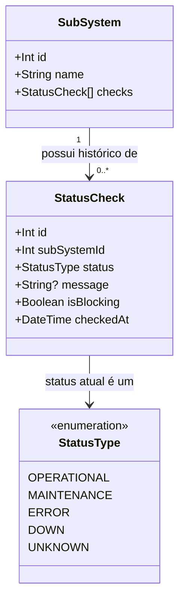
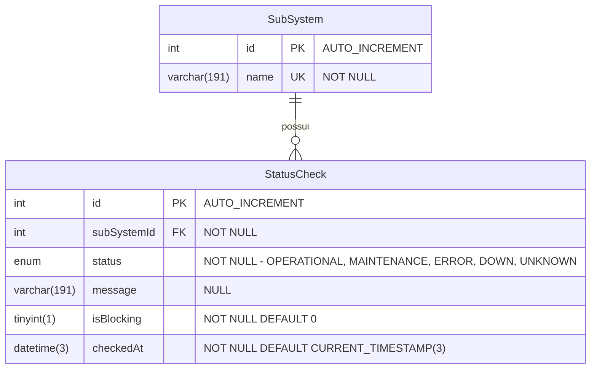
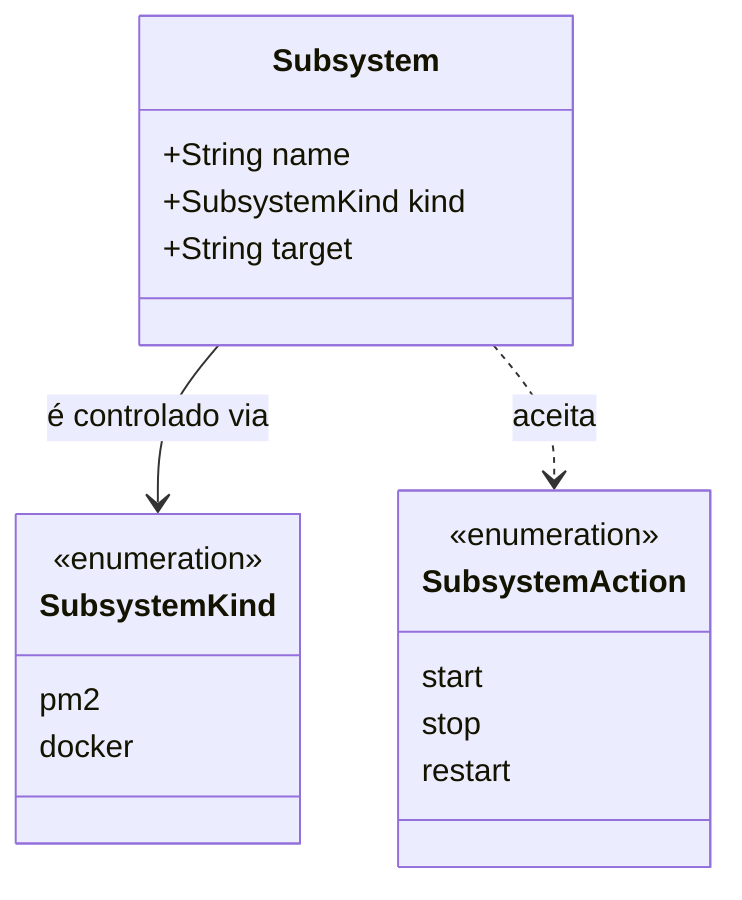
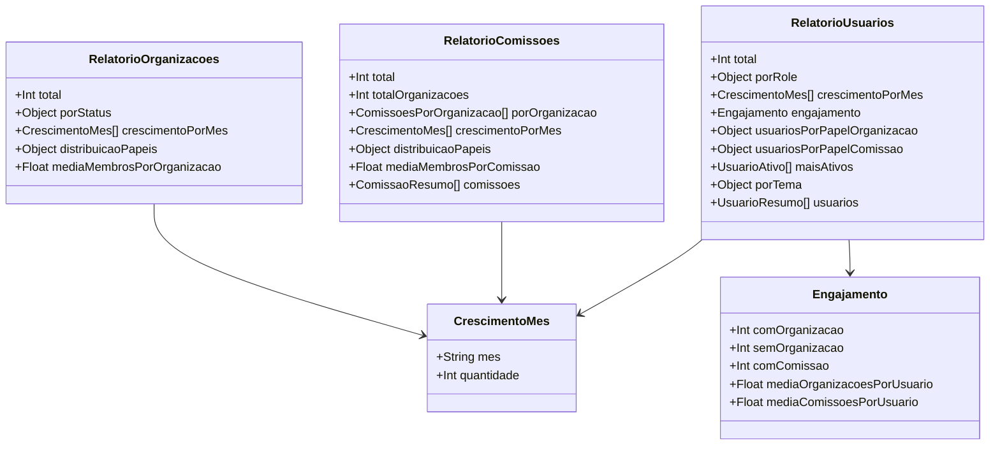
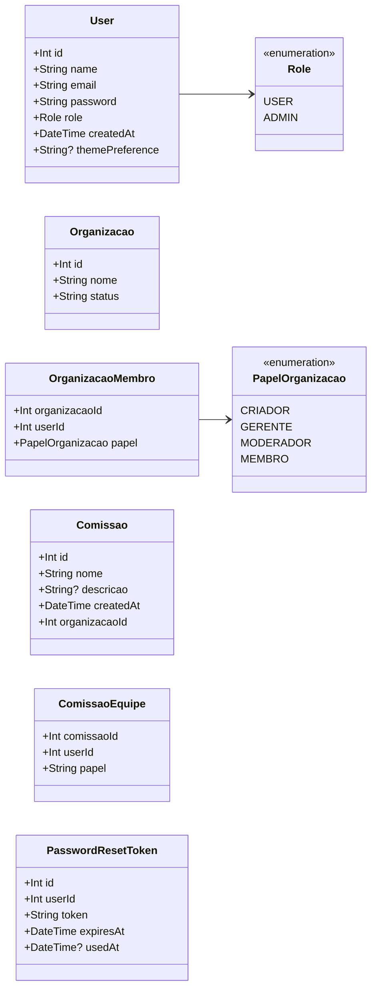
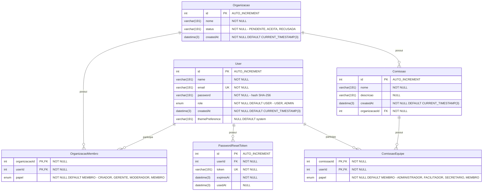

# Diagrama de Classes, Diagrama Relacional e Dicionário de Dados — Entrega Di1

> Este arquivo é organizado por requisito. Cada seção `##` abaixo corresponde a um requisito do Incremento 1 e é de responsabilidade do membro da equipe que o levantou.

---

## Informações do Sistema — Status do Sistema e dos Subsistemas (API de Monitoramento)

Modelo de dados da `monitoring-better-meet`, definido em `monitoring-better-meet/prisma/schema.prisma`. Duas entidades: `SubSystem` (um por sistema monitorado) e `StatusCheck` (um registro por checagem realizada, histórico imutável).

### Diagrama de Classes

### Diagrama Relacional (MySQL)

Banco `monitoring` (container `mysql_monitoring_better_meet_dev`, MySQL 8.4, `utf8mb4_unicode_ci`). Os nomes de tabelas e colunas abaixo são os nomes reais no banco — o Prisma não usa `@map`, então tabelas ficam em PascalCase e colunas em camelCase.

**Restrições e índices (nomes reais no banco)**:

| Tabela | Nome | Tipo | Colunas | Regra |
|---|---|---|---|---|
| `SubSystem` | `PRIMARY` | PK | `id` | — |
| `SubSystem` | `SubSystem_name_key` | UNIQUE | `name` | — |
| `StatusCheck` | `PRIMARY` | PK | `id` | — |
| `StatusCheck` | `StatusCheck_subSystemId_checkedAt_idx` | Índice composto | `subSystemId`, `checkedAt` | Otimiza as consultas de relatório diário e histórico, que sempre filtram por subsistema e por intervalo de data |
| `StatusCheck` | `StatusCheck_subSystemId_fkey` | FK → `SubSystem.id` | `subSystemId` | `ON DELETE CASCADE ON UPDATE CASCADE` |

**Regra de integridade**: por causa do `ON DELETE CASCADE`, se um `SubSystem` for removido, todo o histórico de checagens associado é removido junto (não há hoje um endpoint que remova `SubSystem`, mas a regra está definida no schema por segurança).

### Dicionário de Dados

#### Entidade: `SubSystem`

Representa um sistema monitorado. Criado automaticamente (*upsert*) na primeira vez que reporta um status — não há endpoint de cadastro manual. No setup inicial (`start-all.ps1`), os 6 subsistemas conhecidos são criados com um registro `UNKNOWN` ("Registro inicial (seed via start-all.ps1)"), seguido da checagem real de cada um.

| Atributo | Tipo | Tamanho / Domínio | Obrigatório | Chave | Descrição |
|---|---|---|---|---|---|
| `id` | Int (`int`) | autoincrement | Sim | PK | Identificador único, gerado pelo banco |
| `name` | String (`varchar(191)`) | até 191 caracteres, único | Sim | UK | Nome do subsistema. Valores em uso hoje: `database`, `data-api`, `mobile-app`, `monitoring-database`, `management`, `monitoring` |

#### Entidade: `StatusCheck`

Representa **uma checagem de status** de um `SubSystem`, em um instante específico. Cada checagem (automática pelo cron ou reportada por um serviço externo) gera um novo registro — a tabela nunca é atualizada (`UPDATE`), só recebe inserções, formando o histórico.

| Atributo | Tipo | Tamanho / Domínio | Obrigatório | Chave | Descrição |
|---|---|---|---|---|---|
| `id` | Int (`int`) | autoincrement | Sim | PK | Identificador único da checagem |
| `subSystemId` | Int (`int`) | — | Sim | FK → `SubSystem.id` | Subsistema ao qual essa checagem pertence |
| `status` | Enum (`StatusType`, `enum` no MySQL) | `OPERATIONAL`, `MAINTENANCE`, `ERROR`, `DOWN`, `UNKNOWN` | Sim | — | Resultado da checagem. Ver semântica abaixo |
| `message` | String (`varchar(191)`) | até 191 caracteres | Não | — | Mensagem de contexto (ex.: mensagem de erro, motivo da manutenção) |
| `isBlocking` | Boolean (`tinyint(1)`) | `true` / `false` | Sim (default `false`) | — | Diferencia um erro que impediu o usuário de completar uma ação essencial (`true`) de um erro genérico sem contexto (`false`) |
| `checkedAt` | DateTime (`datetime(3)`) | timestamp com milissegundos | Sim (default `now()`) | — | Data/hora em que a checagem foi realizada/registrada |

#### Domínio: `StatusType` (enum)

| Valor | Severidade | Significado |
|---|---|---|
| `DOWN` | 4 (mais grave) | Sistema indisponível de verdade — é o que o cron grava quando uma checagem automática falha (timeout, conexão recusada, etc.) |
| `ERROR` | 3 | Erro capturado, mas o sistema não está necessariamente indisponível (ex.: erro no app mobile reportado pelo próprio usuário) |
| `MAINTENANCE` | 2 | Sistema em manutenção programada |
| `UNKNOWN` | 1 | Status desconhecido (ex.: nenhuma checagem registrada ainda para aquele subsistema/dia) |
| `OPERATIONAL` | 0 (menos grave) | Sistema funcionando normalmente |

A severidade é usada para calcular o **"pior status do dia"** (`worstStatus`) nos relatórios de histórico — evita que um erro no meio do dia seja mascarado por um status bom registrado no fim do dia.

---

## Informações do Sistema — Reinicialização de Subsistemas, Setup Inicial e Reset (API de Gestão e Infraestrutura)

Diferente da `monitoring-better-meet`, a `management-better-meet` **não possui banco de dados próprio** (ver RNF24 em `requisitos_e_casos_de_uso.md`) — é uma camada de orquestração sem estado: autenticação é validada via JWT compartilhado com a Data API, e status é sempre delegado à API de Monitoramento. Por isso, **o diagrama relacional não se aplica aqui** — o que existe é uma estrutura fixa em memória (a whitelist de subsistemas controláveis, definida no código, não numa tabela).

### Diagrama de Classes (modelo de domínio)

### Diagrama Relacional

Não aplicável — sem banco de dados próprio (ver justificativa acima e RNF24).

### Dicionário de Dados (whitelist de subsistemas, em memória — `SUBSYSTEMS`)

| Nome (`:name`) | `kind` | `target` real | Descrição |
|---|---|---|---|
| `api` | `pm2` | `api` | Data API (Node/Express), processo PM2 |
| `monitoring` | `pm2` | `monitoring` | API de Monitoramento, processo PM2 |
| `management` | `pm2` (caso especial) | `management` | A própria API de Gestão — self-restart com resposta `202` antes do comando (UC09) |
| `database` | `docker` | `mysql_better_meet_dev` | Container MySQL da aplicação (porta 3306) |
| `monitoring-database` | `docker` | `mysql_monitoring_better_meet_dev` | Container MySQL da monitoring (porta 3307) |

### Domínio: `SubsystemAction` (enum)

| Valor | Efeito via PM2 | Efeito via Docker |
|---|---|---|
| `start` | `pm2.start(nome)` | `container.start()` |
| `stop` | `pm2.stop(nome)` | `container.stop()` |
| `restart` | `pm2.restart(nome)` | `container.restart()` |

### Dicionário de Dados (volumes persistentes — `docker-compose.yml`)

Os dados dos dois bancos não ficam dentro dos containers, e sim em **volumes Docker nomeados**. É isso que permite recriar containers sem perder dados e é a base do backup e do reset do sistema (UC12 em `requisitos_e_casos_de_uso.md`).

| Volume (nome no compose) | Nome real no Docker¹ | Container | Serviço do compose | Ponto de montagem | Conteúdo |
|---|---|---|---|---|---|
| `db_better_meet_data` | `sistema_db_better_meet_data` | `mysql_better_meet_dev` | `db_better_meet` | `/var/lib/mysql` | Banco `bettermeet` da aplicação: usuários, organizações, membros, comissões, equipes, tokens de recuperação |
| `db_monitoring_better_meet_data` | `sistema_db_monitoring_better_meet_data` | `mysql_monitoring_better_meet_dev` | `db_monitoring` | `/var/lib/mysql` | Banco `monitoring`: subsistemas e todo o histórico de checagens de status |

¹ O Docker Compose prefixa o nome do volume com o nome do projeto, que por padrão é a pasta do `docker-compose.yml` (`sistema`). Conferir com `docker volume ls` antes de um backup ou remoção.

| Operação | Comando (na pasta `sistema`) | Efeito sobre os dados |
|---|---|---|
| Parar os bancos | `docker compose stop` | Nenhum — containers e volumes preservados |
| Remover só os containers | `docker compose down` | Nenhum — volumes preservados; `start-all.ps1` recria os containers com os dados anteriores |
| Reset completo | `docker compose down -v` | **Apaga** os dois volumes — todos os dados da aplicação e do monitoramento são perdidos |
| Backup de um volume | `docker run --rm -v <volume>:/data -v ${PWD}/backup:/backup alpine tar czf /backup/<volume>.tar.gz -C /data .` | Nenhum — gera um `.tar.gz` com o conteúdo do volume (fazer com o container parado) |
| Restauração de um volume | `docker run --rm -v <volume>:/data -v ${PWD}/backup:/backup alpine sh -c "rm -rf /data/* && tar xzf /backup/<volume>.tar.gz -C /data"` | Substitui o conteúdo do volume pelo backup (container parado, mesma versão `mysql:8.4.0`) |

---

## Informações do Sistema — Relatórios de Usuários, Organizações e Comissões (Data API)

Os relatórios **não possuem entidade nem tabela própria** — são calculados a cada requisição a partir das entidades da Data API (`User`, `Organizacao`, `OrganizacaoMembro`, `Comissao`, `ComissaoEquipe`, descritas na seção "Cadastro de Organização, Comissão e Usuário" abaixo). Por isso, **o diagrama relacional não se aplica** a esta parte; o que se documenta aqui é a estrutura das respostas.

### Diagrama de Classes (estrutura das respostas)

### Diagrama Relacional

Não aplicável — relatórios calculados sob demanda, sem persistência própria (ver RNF33 em `requisitos_e_casos_de_uso.md`).

### Dicionário de Dados

#### Relatório de organizações — `GET /organizacoes/relatorio` (admin) e `GET /organizacoes/relatorio/minhas` (membro)

| Campo | Tipo | Domínio | Origem / Regra de cálculo |
|---|---|---|---|
| `total` | Int | ≥ 0 | Quantidade de organizações consideradas (todas, ou aquelas em que o usuário é membro) |
| `porStatus` | Objeto | chaves `PENDENTE`, `ACEITA`, `RECUSADA` | Contagem de `Organizacao.status` |
| `crescimentoPorMes` | Lista de `{ mes, quantidade }` | 12 itens, `mes` no formato `YYYY-MM` | Organizações por mês de `createdAt`, últimos 12 meses (UTC), meses sem registro com `0` |
| `distribuicaoPapeis` | Objeto | chaves `CRIADOR`, `GERENTE`, `MODERADOR`, `MEMBRO` | Contagem de `OrganizacaoMembro.papel`, **só em organizações `ACEITA`** |
| `mediaMembrosPorOrganizacao` | Float | ≥ 0 | Total de membros ÷ número de organizações `ACEITA` (0 se não houver nenhuma) |

#### Relatório de comissões — `GET /api/comissoes/relatorio` (admin) e `GET /api/comissoes/relatorio/minhas` (membro)

| Campo | Tipo | Domínio | Origem / Regra de cálculo |
|---|---|---|---|
| `total` | Int | ≥ 0 | Quantidade de comissões consideradas (todas, ou aquelas em cuja equipe o usuário está) |
| `totalOrganizacoes` | Int | ≥ 0 | Número de organizações distintas às quais essas comissões pertencem |
| `porOrganizacao` | Lista de `{ organizacaoId, nome, quantidade }` | — | Comissões agrupadas por `Comissao.organizacaoId`, da maior para a menor quantidade |
| `crescimentoPorMes` | Lista de `{ mes, quantidade }` | 12 itens, `YYYY-MM` | Comissões por mês de `createdAt`, últimos 12 meses |
| `distribuicaoPapeis` | Objeto | chaves `ADMINISTRADOR`, `FACILITADOR`, `SECRETARIO`, `MEMBRO` | Contagem de `ComissaoEquipe.papel` |
| `mediaMembrosPorComissao` | Float | ≥ 0 | Total de membros de equipe ÷ número de comissões (0 se não houver nenhuma) |
| `comissoes` | Lista de `{ id, nome, descricao, createdAt, organizacao { id, nome }, membros }` | — | Lista para detalhamento na tela, da mais recente para a mais antiga; `membros` = tamanho da equipe |

#### Relatório de usuários — `GET /usuarios/relatorio` (somente admin)

| Campo | Tipo | Domínio | Origem / Regra de cálculo |
|---|---|---|---|
| `total` | Int | ≥ 0 | Quantidade de usuários cadastrados |
| `porRole` | Objeto | chaves `ADMIN`, `USER` | Contagem de `User.role` |
| `crescimentoPorMes` | Lista de `{ mes, quantidade }` | 12 itens, `YYYY-MM` | Cadastros por mês de `User.createdAt`, últimos 12 meses |
| `engajamento.comOrganizacao` / `semOrganizacao` | Int | ≥ 0 | Usuários com / sem pelo menos um vínculo em `OrganizacaoMembro` |
| `engajamento.comComissao` | Int | ≥ 0 | Usuários com pelo menos um vínculo em `ComissaoEquipe` |
| `engajamento.mediaOrganizacoesPorUsuario` / `mediaComissoesPorUsuario` | Float | ≥ 0 | Total de vínculos ÷ total de usuários |
| `usuariosPorPapelOrganizacao` | Objeto | chaves `CRIADOR`, `GERENTE`, `MODERADOR` | Usuários distintos que têm o papel em pelo menos uma organização (cada usuário conta uma vez por papel) |
| `usuariosPorPapelComissao` | Objeto | chaves `ADMINISTRADOR`, `FACILITADOR`, `SECRETARIO` | Idem, para papéis em comissões |
| `maisAtivos` | Lista de `{ id, name, organizacoes, comissoes }` | até 5 itens | Usuários com pelo menos um vínculo, ordenados pela soma de organizações + comissões |
| `porTema` | Objeto | chaves `light`, `dark`, `system` | Contagem de `User.themePreference`; nulo ou valor desconhecido conta como `system` |
| `usuarios` | Lista de `{ id, name, email, role, createdAt, organizacoes[], comissoes[] }` | — | Todos os usuários (mais recentes primeiro), cada vínculo com `{ id, nome, papel }`. **Não inclui** o hash da senha |

---

## Cadastro de Organização, Comissão e Usuário (Data API)

> Modelo de dados da Data API (`api`), definido em `api/prisma/schema.prisma` e conferido contra o banco `bettermeet` em execução (container `mysql_better_meet_dev`). Esta seção substitui as duas versões anteriores (convertidas do `Diagrama de classes.asta`), que estavam desatualizadas em relação ao banco: citavam um campo `solicitanteId` que não existe, não traziam `Organizacao.createdAt`, `User.themePreference` nem a tabela `PasswordResetToken`, e tratavam os papéis como texto livre, quando são enums. Quem pediu a criação de uma organização é registrado em `OrganizacaoMembro` com o papel `CRIADOR`, não numa coluna da organização.
>
> O diagrama de classes abaixo é o da Wiki do repositório ([Diagrama de Classes](https://github.com/MiguelIFSP/BRTPDS2-PROJETO-E-DESENVOLVIMENTO-DE-SISTEMAS-2/wiki/Diagrama-de-Classes)), elaborado por Cauê Watanabe de Campos, reproduzido sem alterações.

### Diagrama de Classes

#### Observações (do diagrama original)

- A modelagem relacional já representa as associações por meio de chaves estrangeiras e tabelas de junção.
- `OrganizacaoMembro` atua como entidade associativa entre `User` e `Organizacao`.
- `ComissaoEquipe` atua como entidade associativa entre `User` e `Comissao`.
- `PasswordResetToken` guarda tokens temporários para recuperação de senha.
- O diagrama mostra os conceitos principais do domínio, sem redundância com as relações já existentes no banco.

#### Complementos ao diagrama (conferidos no schema e no banco)

- `Organizacao` também possui o atributo `createdAt` (DateTime, default `now()`), usado pelos relatórios de crescimento mensal.
- `ComissaoEquipe.papel` é do tipo enum `PapelComissao` (`ADMINISTRADOR`, `FACILITADOR`, `SECRETARIO`, `MEMBRO`), e não um texto livre.

### Diagrama Relacional (MySQL)

Banco `bettermeet` (MySQL 8.4, `utf8mb4_unicode_ci`). Os nomes de tabelas e colunas abaixo são os nomes reais no banco — o Prisma não usa `@map`, então tabelas ficam em PascalCase e colunas em camelCase.

**Restrições e índices (nomes reais no banco)**:

| Tabela | Nome | Tipo | Colunas | Regra |
|---|---|---|---|---|
| `User` | `PRIMARY` | PK | `id` | — |
| `User` | `User_email_key` | UNIQUE | `email` | — |
| `Organizacao` | `PRIMARY` | PK | `id` | — |
| `OrganizacaoMembro` | `PRIMARY` | PK composta | `organizacaoId`, `userId` | O mesmo usuário não entra duas vezes na mesma organização |
| `OrganizacaoMembro` | `OrganizacaoMembro_organizacaoId_fkey` | FK → `Organizacao.id` | `organizacaoId` | `ON DELETE CASCADE` |
| `OrganizacaoMembro` | `OrganizacaoMembro_userId_fkey` | FK → `User.id` | `userId` | `ON DELETE CASCADE` |
| `Comissao` | `PRIMARY` | PK | `id` | — |
| `Comissao` | `Comissao_organizacaoId_fkey` | FK → `Organizacao.id` | `organizacaoId` | `ON DELETE CASCADE` |
| `ComissaoEquipe` | `PRIMARY` | PK composta | `comissaoId`, `userId` | O mesmo usuário não entra duas vezes na mesma comissão |
| `ComissaoEquipe` | `ComissaoEquipe_comissaoId_fkey` | FK → `Comissao.id` | `comissaoId` | `ON DELETE CASCADE` |
| `ComissaoEquipe` | `ComissaoEquipe_userId_fkey` | FK → `User.id` | `userId` | `ON DELETE CASCADE` |
| `PasswordResetToken` | `PRIMARY` | PK | `id` | — |
| `PasswordResetToken` | `PasswordResetToken_token_key` | UNIQUE | `token` | — |
| `PasswordResetToken` | `PasswordResetToken_userId_idx` | Índice | `userId` | — |
| `PasswordResetToken` | `PasswordResetToken_userId_fkey` | FK → `User.id` | `userId` | `ON DELETE CASCADE` |

**Regras de integridade (cascatas)**:
- Remover uma **organização** remove suas comissões, as equipes dessas comissões e os vínculos de membros da organização.
- Remover uma **comissão** remove sua equipe.
- Remover um **usuário** remove seus vínculos com organizações e comissões e seus tokens de recuperação — as organizações e comissões em si permanecem.

### Dicionário de Dados

Na coluna "Tipo", o primeiro valor é o tipo no Prisma e, entre parênteses, o tipo real no MySQL. Os limites de tamanho menores que 191 são validados pela aplicação (Yup), não pelo banco.

#### Entidade: `User`

| Atributo | Tipo | Domínio | Obrigatório | Chave | Descrição |
|---|---|---|---|---|---|
| `id` | Int (`int`) | autoincrement | Sim | PK | Identificador único |
| `name` | String (`varchar(191)`) | 2 a 80 caracteres (validação da aplicação) | Sim | — | Nome completo; também aceito como identificador no login |
| `email` | String (`varchar(191)`) | e-mail válido, até 160 caracteres (aplicação), único | Sim | UK | E-mail, usado como login |
| `password` | String (`varchar(191)`) | hash SHA-256 em hexadecimal (64 caracteres) | Sim | — | Senha, nunca em texto plano. A senha original deve ter de 8 a 72 caracteres, com pelo menos uma letra maiúscula, uma minúscula e um número |
| `role` | Enum `Role` (`enum('USER','ADMIN')`) | `USER`, `ADMIN` | Sim (default `USER`) | — | Papel na plataforma. O cadastro público só cria `USER`; o administrador padrão (`admin@bettermeet.com`) é criado pela própria Data API ao iniciar |
| `createdAt` | DateTime (`datetime(3)`) | timestamp com milissegundos | Sim (default `now()`) | — | Data de cadastro |
| `themePreference` | String (`varchar(191)`) | `light`, `dark`, `system` | Não (default `system`) | — | Tema preferido do app; retornado no login para o app aplicar o tema |

#### Entidade: `Organizacao`

| Atributo | Tipo | Domínio | Obrigatório | Chave | Descrição |
|---|---|---|---|---|---|
| `id` | Int (`int`) | autoincrement | Sim | PK | Identificador único |
| `nome` | String (`varchar(191)`) | até 80 caracteres (validação da aplicação) | Sim | — | Nome da organização |
| `status` | String (`varchar(191)`) | `PENDENTE`, `ACEITA`, `RECUSADA` | Sim | — | `PENDENTE` na criação; alterado para `ACEITA` ou `RECUSADA` somente por um `ADMIN` |
| `createdAt` | DateTime (`datetime(3)`) | timestamp com milissegundos | Sim (default `now()`) | — | Data da solicitação de criação |

#### Entidade: `OrganizacaoMembro`

Tabela de associação — vincula um `User` a uma `Organizacao` da qual participa. Na criação de uma organização, o usuário solicitante é inserido aqui com o papel `CRIADOR`.

| Atributo | Tipo | Domínio | Obrigatório | Chave | Descrição |
|---|---|---|---|---|---|
| `organizacaoId` | Int (`int`) | — | Sim | PK (composta), FK → `Organizacao.id` | Organização |
| `userId` | Int (`int`) | — | Sim | PK (composta), FK → `User.id` | Usuário membro |
| `papel` | Enum `PapelOrganizacao` (`enum`) | `CRIADOR`, `GERENTE`, `MODERADOR`, `MEMBRO` | Sim (default `MEMBRO`) | — | Papel do usuário na organização (ver domínio abaixo) |

#### Domínio: `PapelOrganizacao` (enum)

| Valor | Significado |
|---|---|
| `CRIADOR` | Quem solicitou a criação da organização. Apenas um por organização; ninguém é promovido a este papel |
| `GERENTE` | No máximo um por organização; pode adicionar e remover membros |
| `MODERADOR` | No máximo dois por organização; pode apenas adicionar membros |
| `MEMBRO` | Participante comum |

#### Entidade: `Comissao`

| Atributo | Tipo | Domínio | Obrigatório | Chave | Descrição |
|---|---|---|---|---|---|
| `id` | Int (`int`) | autoincrement | Sim | PK | Identificador único |
| `nome` | String (`varchar(191)`) | até 80 caracteres (validação da aplicação) | Sim | — | Nome da comissão/grupo de trabalho |
| `descricao` | String (`varchar(191)`) | até 500 caracteres na validação da aplicação, mas o banco aceita no máximo 191 | Não | — | Descrição opcional |
| `createdAt` | DateTime (`datetime(3)`) | timestamp com milissegundos | Sim (default `now()`) | — | Data de criação |
| `organizacaoId` | Int (`int`) | — | Sim | FK → `Organizacao.id` | Organização à qual a comissão pertence (`ON DELETE CASCADE`) |

#### Entidade: `ComissaoEquipe`

Tabela de associação — vincula um `User` a uma `Comissao` da qual participa.

| Atributo | Tipo | Domínio | Obrigatório | Chave | Descrição |
|---|---|---|---|---|---|
| `comissaoId` | Int (`int`) | — | Sim | PK (composta), FK → `Comissao.id` | Comissão |
| `userId` | Int (`int`) | — | Sim | PK (composta), FK → `User.id` | Usuário membro da equipe |
| `papel` | Enum `PapelComissao` (`enum`) | `ADMINISTRADOR`, `FACILITADOR`, `SECRETARIO`, `MEMBRO` | Sim (default `MEMBRO`) | — | Papel do usuário na comissão (ver domínio abaixo) |

#### Domínio: `PapelComissao` (enum)

| Valor | Significado |
|---|---|
| `ADMINISTRADOR` | Controle total da comissão, inclusive excluí-la. Quem cria a comissão recebe este papel |
| `FACILITADOR` | Pode gerenciar os membros e as pautas |
| `SECRETARIO` | Responsável por registrar as atas e decisões |
| `MEMBRO` | Participante comum |

#### Entidade: `PasswordResetToken`

Tokens temporários para recuperação de conta, mantidos em tabela separada de `User` para guardar histórico dos tokens emitidos e permitir mais de um token válido ao mesmo tempo.

| Atributo | Tipo | Domínio | Obrigatório | Chave | Descrição |
|---|---|---|---|---|---|
| `id` | Int (`int`) | autoincrement | Sim | PK | Identificador único |
| `userId` | Int (`int`) | — | Sim | FK → `User.id` (indexada) | Usuário dono do token |
| `token` | String (`varchar(191)`) | único | Sim | UK | Valor do token de recuperação |
| `expiresAt` | DateTime (`datetime(3)`) | timestamp | Sim | — | Data/hora a partir da qual o token deixa de valer |
| `usedAt` | DateTime (`datetime(3)`) | timestamp | Não | — | Data/hora em que o token foi usado; nulo enquanto não usado |

> **Observação**: a tabela existe no schema e no banco, mas **o código atual não a utiliza** — o fluxo de recuperação (`authController.ts`) localiza o usuário pelo e-mail e grava a nova senha diretamente, sem emitir nem validar token. Se o fluxo com token for implementado, esta tabela já está pronta; caso contrário, a documentação do caso de uso de Recuperação de conta deve refletir o comportamento atual.

### Diagrama de Casos de Uso (referência)

O diagrama de casos de uso e sua descrição no formulário padrão ficam em `requisitos_e_casos_de_uso.md`, na seção "Cadastro de Organização".
