# Requisitos e Casos de Uso — Entrega Di1

> Este arquivo é organizado por requisito. Cada seção `##` abaixo corresponde a um requisito do Incremento 1 e é de responsabilidade do membro da equipe que o levantou. Ao adicionar seu requisito, siga o mesmo formato: diagrama de casos de uso, descrição de cada caso de uso, diagrama de sequência e requisitos não funcionais.

---

## Informações do Sistema — Status do Sistema e dos Subsistemas (API de Monitoramento)

> Cobre apenas a parte de **status do sistema e dos seus subsistemas** do requisito "Informações do sistema" (slide 9), implementada pela `monitoring-better-meet`. As demais partes do requisito (relatórios de usuários/organizações/comissões, reinicialização de subsistemas, setup inicial e reset do sistema) pertencem à `management-better-meet` e têm documentação própria.

### Atores

| Ator | Tipo | Descrição |
|---|---|---|
| Usuário Autenticado | Humano (abstrato) | Generaliza os dois atores humanos abaixo — qualquer um com JWT válido pode consultar status (UC01–UC03) |
| Usuário do App Mobile | Humano | Usuário final do Better Meet; vê o status de 3 subsistemas (`mobile-app`, `data-api`, `database`) na tela "Status do sistema" |
| Administrador (Painel de Gestão) | Humano | Usuário técnico/admin que usa o painel web da `management-better-meet`; vê todos os 6 subsistemas |
| Cron de Monitoramento | Automático / temporal | Job interno da própria API de monitoramento, roda a cada 3 horas sem intervenção humana |
| Sistema Externo | Sistema (abstrato) | Generaliza os três sistemas abaixo — qualquer um pode reportar seu próprio status (UC05) |
| App Mobile (Better Meet) | Sistema externo | O próprio aplicativo mobile, reportando seus próprios erros de execução |
| API de Gestão | Sistema externo | Se auto-reporta ao iniciar/parar; é quem de fato chama a checagem sob demanda (UC06) em nome do Administrador |
| Data API | Sistema externo | Se auto-reporta à monitoring ao iniciar/parar |

### Diagrama de Casos de Uso

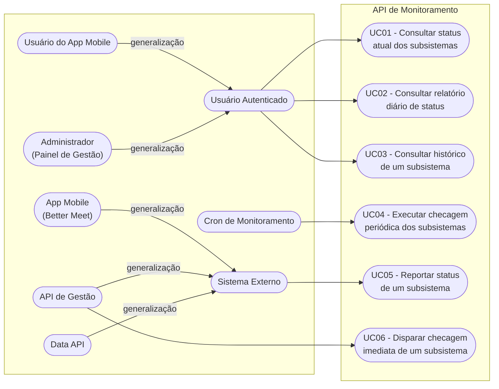

### Descrição dos Casos de Uso

#### UC01 — Consultar status atual dos subsistemas

| Campo | Descrição |
|---|---|
| **Ator(es)** | Usuário do App Mobile, Administrador (Painel de Gestão) |
| **Descrição** | Permite ao ator visualizar o status mais recente registrado de cada subsistema monitorado |
| **Pré-condições** | Ator autenticado (JWT válido, obtido no login da Data API) |
| **Fluxo Principal** | 1. Ator abre a tela/painel de status. 2. Cliente envia `GET /monitoring-better-meet/status` com `Authorization: Bearer <token>`. 3. Sistema valida o token. 4. Sistema busca, para cada `SubSystem`, o `StatusCheck` mais recente. 5. Sistema retorna a lista (id, nome, status, mensagem, data/hora da última checagem). 6. Cliente exibe o status de cada subsistema. |
| **Fluxos Alternativos / Exceção** | 3a. Token ausente ou inválido → sistema retorna `401 Unauthorized`; cliente redireciona ao login. 4a. Subsistema sem nenhum `StatusCheck` ainda → retorna status `UNKNOWN`. |
| **Pós-condições** | Ator visualiza o status atual de cada subsistema ao qual tem acesso |

#### UC02 — Consultar relatório diário de status

| Campo | Descrição |
|---|---|
| **Ator(es)** | Usuário do App Mobile, Administrador (Painel de Gestão) |
| **Descrição** | Permite consultar um resumo agregado (uptime, pior status do dia) de todos os subsistemas em um dia específico |
| **Pré-condições** | Ator autenticado (JWT válido) |
| **Fluxo Principal** | 1. Ator seleciona a data desejada (ou usa o dia atual, padrão). 2. Cliente envia `GET /monitoring-better-meet/status/daily?date=YYYY-MM-DD` com Bearer token. 3. Sistema valida o token. 4. Sistema busca todas as checagens do dia por subsistema. 5. Sistema calcula `totalChecks`, `uptimePercentage` e `lastStatus` por subsistema. 6. Sistema retorna o relatório agregado. |
| **Fluxos Alternativos / Exceção** | 2a. Data inválida no parâmetro → `400 Bad Request`. 3a. Token inválido → `401 Unauthorized`. 4a. Subsistema sem nenhuma checagem no dia → `totalChecks: 0`, `uptimePercentage: null`. |
| **Pós-condições** | Ator visualiza o resumo do dia por subsistema |

#### UC03 — Consultar histórico de um subsistema

| Campo | Descrição |
|---|---|
| **Ator(es)** | Usuário do App Mobile, Administrador (Painel de Gestão) |
| **Descrição** | Permite consultar a evolução do status de UM subsistema ao longo de N dias |
| **Pré-condições** | Ator autenticado (JWT válido); subsistema já existente na base |
| **Fluxo Principal** | 1. Ator seleciona um subsistema e o período (dias, padrão 7). 2. Cliente envia `GET /monitoring-better-meet/status/:subSystemId/history?days=N` com Bearer token. 3. Sistema valida o token. 4. Sistema monta o "esqueleto" de todos os dias do período (mesmo sem checagem). 5. Sistema preenche cada dia com `totalChecks`, `uptimePercentage`, `lastStatus` e `worstStatus`. 6. Sistema retorna o histórico. |
| **Fluxos Alternativos / Exceção** | 3a. Token inválido → `401 Unauthorized`. 2a. `subSystemId` não existe → `404 Not Found`. 5a. Dia sem nenhuma checagem → aparece no histórico com `totalChecks: 0`, útil para identificar "buracos" de monitoramento. |
| **Pós-condições** | Ator visualiza a linha do tempo de status do subsistema escolhido |

#### UC04 — Executar checagem periódica dos subsistemas

| Campo | Descrição |
|---|---|
| **Ator(es)** | Cron de Monitoramento (automático) |
| **Descrição** | A cada 3 horas (00h, 03h, 06h, 09h, 12h, 15h, 18h, 21h), o sistema verifica a saúde de cada subsistema e registra o resultado, sem intervenção humana |
| **Pré-condições** | Processo da API de monitoramento em execução |
| **Fluxo Principal** | 1. Agendador (`node-cron`, expressão `0 */3 * * *`) dispara o job. 2. Sistema executa, em paralelo, uma checagem por subsistema: `database` (conexão direta MySQL, `SELECT 1`), `data-api` e `management` (`GET /health`), `monitoring-database` (query no próprio Prisma), `monitoring` (sempre operacional, se o cron rodou o processo está de pé) e `mobile-app` (verifica se não há erro reportado nas últimas 6h). 3. Cada checagem grava um `StatusCheck` (status `OPERATIONAL` ou `DOWN`, com a mensagem de erro se houver). |
| **Fluxos Alternativos / Exceção** | 2a. Falha ao conectar/checar um subsistema (timeout de 5s, conexão recusada) → grava `DOWN` com a mensagem do erro, sem interromper as demais checagens (isoladas via `Promise.all` + try/catch individual). 2b. `mobile-app` com erro reportado nas últimas 6h → **não** sobrescreve com `OPERATIONAL`, para não mascarar o erro recém-reportado. |
| **Pós-condições** | Histórico de status atualizado para todos os subsistemas, disponível para consulta (UC01–UC03) |

#### UC05 — Reportar status de um subsistema

| Campo | Descrição |
|---|---|
| **Ator(es)** | App Mobile (Better Meet), API de Gestão / Data API |
| **Descrição** | Permite que um sistema externo registre, ele mesmo, um evento de status (ex.: erro capturado no app, ou "estou operacional" ao subir) |
| **Pré-condições** | Ator possui a `x-api-key` válida configurada |
| **Fluxo Principal** | 1. Ator captura um evento (erro no app, início/parada de serviço). 2. Ator envia `POST /monitoring-better-meet/status` com header `x-api-key` e corpo `{ subSystem, status, message?, isBlocking? }`. 3. Sistema valida a `x-api-key` (comparação em tempo constante). 4. Sistema cria o `SubSystem` automaticamente se ainda não existir (upsert). 5. Sistema grava o `StatusCheck`. 6. Sistema retorna `201 Created` com o registro criado. |
| **Fluxos Alternativos / Exceção** | 3a. `x-api-key` ausente ou inválida → `401 Unauthorized`. 2a. `subSystem` ou `status` ausentes, ou `status` fora do enum → `400 Bad Request`. |
| **Pós-condições** | Novo `StatusCheck` disponível no histórico do subsistema |

#### UC06 — Disparar checagem imediata de um subsistema

| Campo | Descrição |
|---|---|
| **Ator(es)** | API de Gestão (`management-better-meet`) |
| **Descrição** | Permite forçar a checagem de UM subsistema fora do horário do cron — usado depois de start/stop/restart de um serviço, para o painel refletir a mudança sem esperar até 3h |
| **Pré-condições** | Ator possui a `x-api-key` válida; subsistema informado é um dos conhecidos pelo sistema |
| **Fluxo Principal** | 1. Ator (ex.: `management-better-meet`) reinicia um serviço. 2. Ator envia `POST /monitoring-better-meet/status/:subSystem/check` com `x-api-key`. 3. Sistema valida a `x-api-key`. 4. Sistema executa, imediatamente, a checagem correspondente àquele subsistema (mesma lógica do UC04, mas só para um). 5. Sistema grava o `StatusCheck` resultante. 6. Sistema retorna o status mais recente do subsistema. |
| **Fluxos Alternativos / Exceção** | 3a. `x-api-key` inválida → `401 Unauthorized`. 2a. Nome de subsistema desconhecido → `404 Not Found`. |
| **Pós-condições** | Status do subsistema atualizado imediatamente, refletido nas próximas consultas (UC01) |

### Diagramas de Sequência

#### UC01 — Consultar status atual

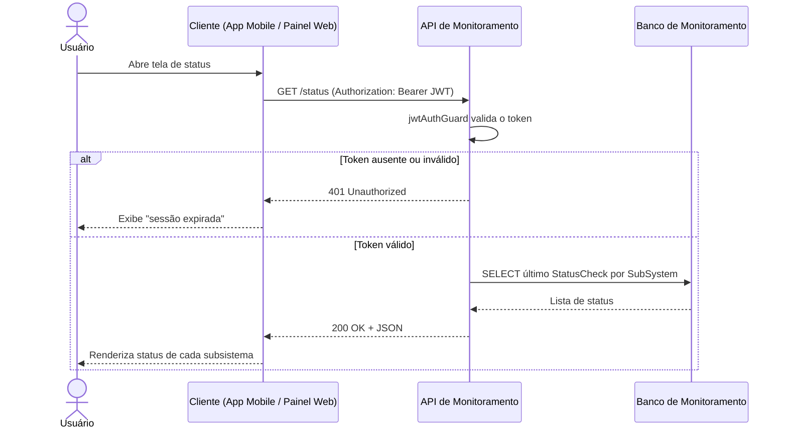

#### UC02 — Consultar relatório diário

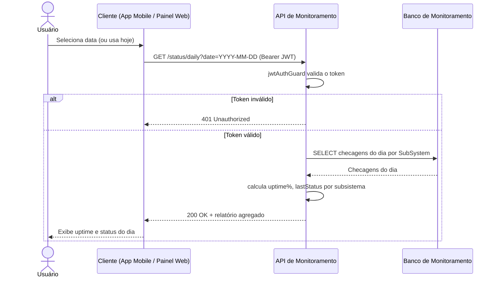

#### UC03 — Consultar histórico de um subsistema

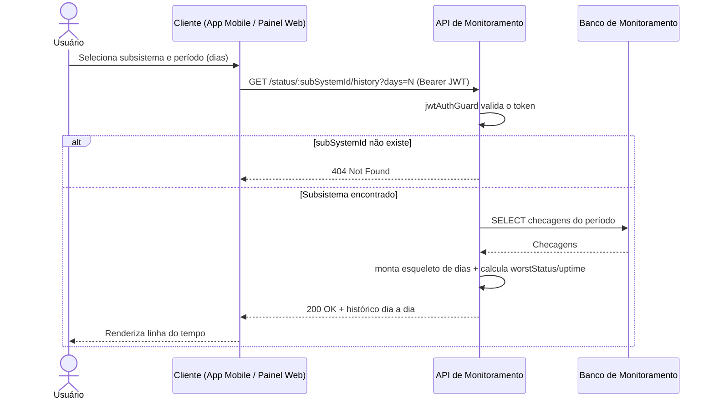

#### UC04 — Executar checagem periódica

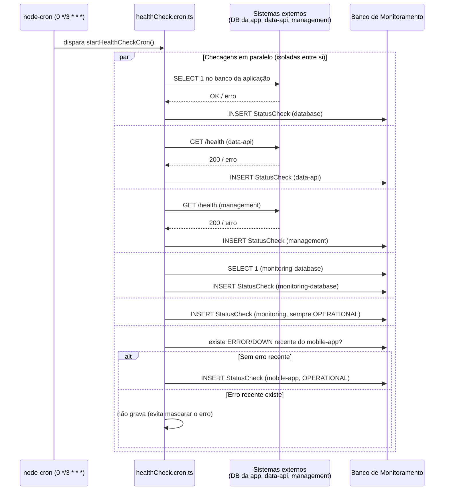

#### UC05 — Reportar status de um subsistema

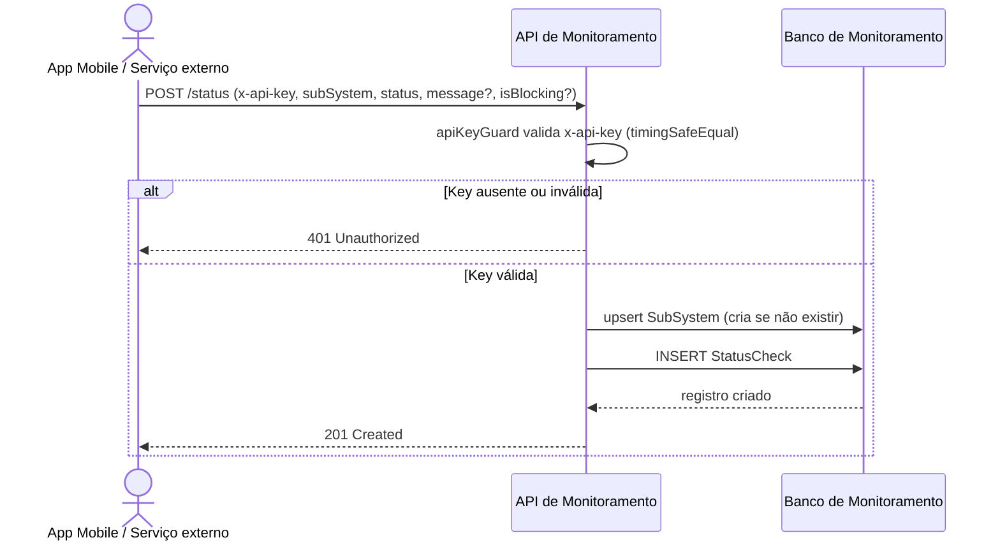

#### UC06 — Disparar checagem imediata

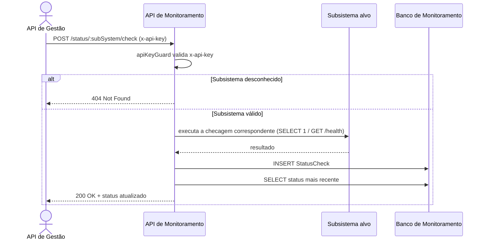

### Requisitos Não Funcionais

| Código | Requisito | Descrição |
|---|---|---|
| RNF01 | Periodicidade das checagens automáticas | O sistema deve verificar a saúde dos subsistemas a cada 3 horas (00h, 03h, 06h, 09h, 12h, 15h, 18h, 21h), sem intervenção manual |
| RNF02 | Isolamento de falhas entre checagens | A falha em checar um subsistema não pode impedir a checagem dos demais (checagens executadas em paralelo, cada uma com seu próprio tratamento de erro) |
| RNF03 | Timeout de checagens externas | Toda chamada de rede a um subsistema externo deve ter timeout de 5 segundos, para não travar o ciclo do cron indefinidamente |
| RNF04 | Autenticação diferenciada por tipo de acesso | Rotas de leitura (consulta de status) exigem token JWT de usuário autenticado; rotas de escrita (registrar/forçar checagem) exigem chave de API própria para comunicação entre serviços |
| RNF05 | Comparação seguro de credenciais | A validação da chave de API deve ser feita em tempo constante (`crypto.timingSafeEqual`), para não expor a chave a ataques de timing |
| RNF06 | Isolamento de infraestrutura | O banco de dados de monitoramento deve rodar em um container/instância separada do banco da aplicação, para que uma falha no banco da aplicação não derrube também o monitoramento |
| RNF07 | Retenção histórica | Registros de status (`StatusCheck`) não são sobrescritos nem apagados automaticamente — cada checagem gera um novo registro, preservando o histórico completo para cálculo de uptime e auditoria |
| RNF08 | Tecnologia | API REST implementada em Node.js + TypeScript + Express, com Prisma ORM sobre MySQL 8.4, containerizado via Docker |

---

## Informações do Sistema — Reinicialização de Subsistemas e Setup Inicial (API de Gestão)

> Cobre as partes de **reinicialização de subsistemas**, **setup inicial e inicialização do sistema** e **reset do sistema** do requisito "Informações do sistema" (slide 9), implementadas pela `management-better-meet`. A parte de "status do sistema e dos subsistemas" está documentada na seção anterior (API de Monitoramento). A parte de "relatórios de usuários/organizações/comissões" não é implementada por este subsistema — pertence à Data API (`api`) e está fora do escopo desta seção.

### Atores

| Ator | Tipo | Descrição |
|---|---|---|
| Administrador (Painel de Gestão) | Humano, primário | Único ator autorizado a agir sobre os subsistemas; precisa de conta com `role: ADMIN` na Data API |
| PM2 | Sistema externo, **secundário** | Gerenciador de processos Node.js — controla de fato `api`, `monitoring` e a própria `management`; participa como consequência de UC08/UC09/UC11, não os inicia |
| Docker Engine | Sistema externo, **secundário** | Controla os containers dos dois bancos (`mysql_better_meet_dev`, `mysql_monitoring_better_meet_dev`); participa como consequência de UC08/UC11, não os inicia |
| API de Monitoramento | Sistema externo, **secundário** | Recebe o auto-report de status da `management` (UC10) e as checagens sob demanda disparadas após UC08/UC09; participa como consequência, não inicia nenhum caso de uso |

### Diagrama de Casos de Uso

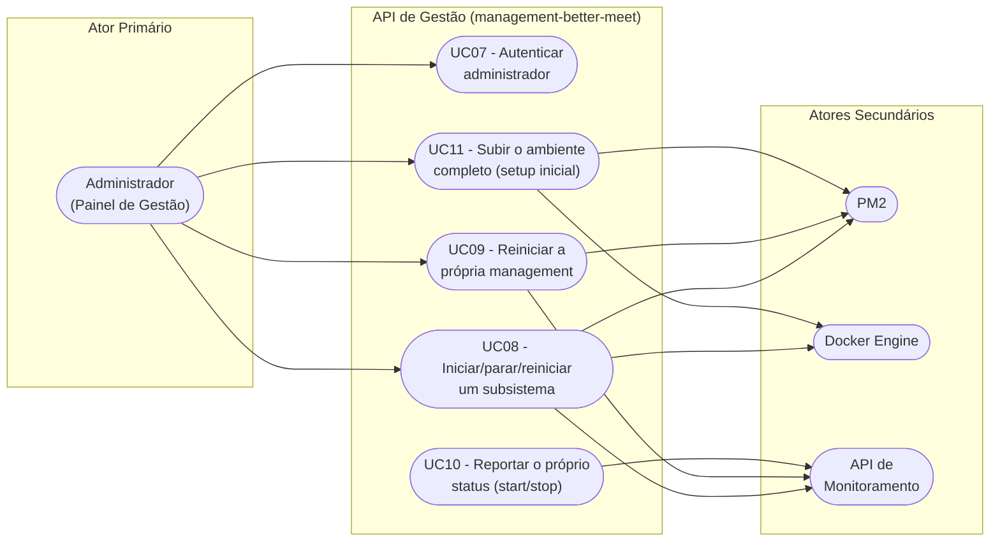

### Descrição dos Casos de Uso

#### UC07 — Autenticar administrador

| Campo | Descrição |
|---|---|
| **Ator(es)** | Administrador (Painel de Gestão) |
| **Descrição** | Permite que um usuário com `role: ADMIN` acesse o painel de gestão; usuários comuns são bloqueados mesmo com credenciais válidas |
| **Pré-condições** | Usuário possui conta cadastrada na Data API |
| **Fluxo Principal** | 1. Administrador informa usuário/e-mail e senha na tela de login do painel. 2. Painel envia `POST /login` para a Data API. 3. Data API valida as credenciais e retorna `{ id, name, email, role, token }` (JWT válido por 7 dias). 4. Painel verifica se `role === 'ADMIN'`. 5. Painel guarda o token (persistido via AsyncStorage) e libera o acesso ao painel. |
| **Fluxos Alternativos / Exceção** | 3a. Credenciais inválidas → `401 Unauthorized`; exibe mensagem, não reporta como erro de sistema (é comportamento normal do usuário). 4a. `role !== 'ADMIN'` → acesso negado pelo próprio painel ("Este painel é restrito a administradores"), mesmo com login válido. 2a. Falha de rede ao contatar a Data API → reporta erro à monitoring (`subSystem: management`) e exibe mensagem de falha de conexão. |
| **Pós-condições** | Administrador autenticado, com token válido para as demais operações do painel |

#### UC08 — Iniciar, parar ou reiniciar um subsistema

| Campo | Descrição |
|---|---|
| **Ator(es)** | Administrador (Painel de Gestão), PM2, Docker Engine, API de Monitoramento |
| **Descrição** | Permite ao administrador controlar o ciclo de vida de qualquer subsistema (`api`, `monitoring`, `database`, `monitoring-database`) a partir do painel, sem precisar de acesso direto ao servidor |
| **Pré-condições** | Administrador autenticado (UC07); a própria API de Gestão está operacional |
| **Fluxo Principal** | 1. Administrador clica em Iniciar/Parar/Reiniciar num card do painel. 2. Painel envia `POST /subsystems/:name/:action` com `Authorization: Bearer <token>`. 3. Sistema valida o token e exige `role: ADMIN`. 4. Sistema consulta a whitelist interna pra saber se o alvo é controlado via PM2 (`api`, `monitoring`) ou via Docker (`database`, `monitoring-database`). 5a. Se PM2: conecta ao daemon do PM2 e executa `start`/`stop`/`restart` pelo nome do processo. 5b. Se Docker: usa a API do Docker Engine (named pipe no Windows / socket Unix no Linux) pra executar a mesma ação no container. 6. Sistema retorna `200 OK`. 7. Painel aguarda 5s, pede à API de Monitoramento pra checar aquele subsistema agora (checagem imediata), aguarda mais 5s, e então atualiza status e histórico na tela. |
| **Fluxos Alternativos / Exceção** | 3a. Token ausente/inválido → `401`; papel diferente de ADMIN → `403`. 4a. Nome de subsistema fora da whitelist → `404 Not Found` (nenhum comando arbitrário chega ao PM2/Docker). 5a. Falha ao executar a ação (processo/container não existe, Docker inacessível) → `500`; painel reporta o erro à monitoring e mantém os botões habilitados pra nova tentativa. Ação sobre `management` → segue o fluxo especial do UC09, não este. |
| **Pós-condições** | Subsistema no novo estado solicitado; painel refletindo o status atualizado após o intervalo de checagem |

#### UC09 — Reiniciar a própria API de Gestão

| Campo | Descrição |
|---|---|
| **Ator(es)** | Administrador (Painel de Gestão), PM2 |
| **Descrição** | Caso especial do UC08: como a própria API de Gestão é quem processaria o pedido, ela precisa responder antes de se desligar — senão a conexão HTTP nunca receberia resposta |
| **Pré-condições** | Administrador autenticado; API de Gestão operacional (pra receber o pedido) |
| **Fluxo Principal** | 1. Administrador clica em Parar/Reiniciar no card "API de Gestão (esta)". 2. Painel envia `POST /subsystems/management/:action`. 3. Sistema responde imediatamente `202 Accepted`. 4. Depois de um pequeno atraso (100ms), sistema pede ao PM2 pra executar a ação sobre o próprio processo. 5. PM2 encerra o processo atual e, se a ação foi `start`/`restart`, sobe uma nova instância. 6. A nova instância reporta `OPERATIONAL` à monitoring ao subir (UC10). |
| **Fluxos Alternativos / Exceção** | 4a. Se a ação falhar depois do `202` já enviado, o erro só é registrado no log do servidor — o painel não recebe essa falha diretamente. Enquanto a própria `management` está fora do ar (ação `stop`, ou falha ao voltar), **nenhuma** ação de nenhum subsistema funciona pelo painel — inclusive religá-la de volta —, porque é ela quem serve o próprio painel e a API que executa as ações. Recuperação nesse caso é manual (`pm2 start management` direto no servidor). |
| **Pós-condições** | API de Gestão no novo estado; se ficou de pé, o painel volta a responder normalmente em poucos segundos |

#### UC10 — Reportar o próprio status ao iniciar ou parar

| Campo | Descrição |
|---|---|
| **Ator(es)** | API de Gestão (automático), API de Monitoramento |
| **Descrição** | A API de Gestão se auto-reporta à monitoring nos dois extremos do seu ciclo de vida, pra refletir mudanças de estado sem esperar o próximo ciclo do cron (a cada 3h) |
| **Pré-condições** | `MONITORING_API_URL` e `INTERNAL_API_KEY` configurados no `.env` da `management` |
| **Fluxo Principal** | 1a. Ao subir e começar a escutar na porta, sistema envia `POST /monitoring-better-meet/status` com `subSystem: "management"`, `status: "OPERATIONAL"`. 1b. Ao receber `SIGINT`/`SIGTERM` (comando de parada do PM2, inclusive o do próprio UC09), sistema envia o mesmo POST com `status: "MAINTENANCE"` **antes** de efetivamente sair do processo. |
| **Fluxos Alternativos / Exceção** | Falha de rede ao reportar → erro é silenciado (log local), não pode travar o start/stop da `management` por causa disso; timeout curto (1.5s) no report de parada, porque o PM2 mata o processo à força (~1.6s) se ele não sair rápido o suficiente. |
| **Pós-condições** | Monitoring com o status mais recente da `management`, sem depender do cron |

#### UC11 — Subir o ambiente completo (setup inicial)

| Campo | Descrição |
|---|---|
| **Ator(es)** | Administrador (acesso direto ao servidor, fora do painel web) |
| **Descrição** | Prepara e inicializa todos os subsistemas de uma vez, numa máquina nova ou depois de uma parada total — não é uma ação do painel, é um script rodado direto no servidor |
| **Pré-condições** | Node.js, Docker Desktop e `pm2` (global) instalados na máquina |
| **Fluxo Principal** | 1. Administrador roda `install-all.ps1` (uma vez) — instala as dependências (`npm install`) de todos os projetos. 2. Administrador cria os arquivos `.env` de cada projeto. 3. Administrador roda `start-all.ps1`: sobe os containers dos bancos via `docker compose up -d` (cria na primeira vez, só inicia depois), builda `monitoring` e `management`, builda o painel web e sobe os três processos Node via `pm2 start ecosystem.config.js`. |
| **Fluxos Alternativos / Exceção** | Rodar `start-all.ps1` de novo é seguro (idempotente) — não duplica container, e o PM2 apenas reinicia o que já estava rodando. |
| **Pós-condições** | Os cinco subsistemas (`api`, `monitoring`, `management` e os dois bancos) em execução; painel administrativo acessível em `/admin` |

### Diagramas de Sequência

#### UC07 — Autenticar administrador

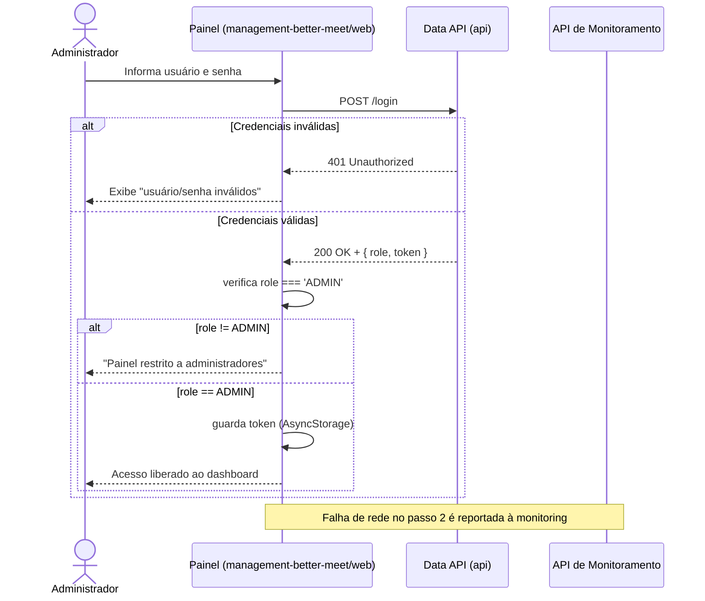

#### UC08 — Iniciar, parar ou reiniciar um subsistema

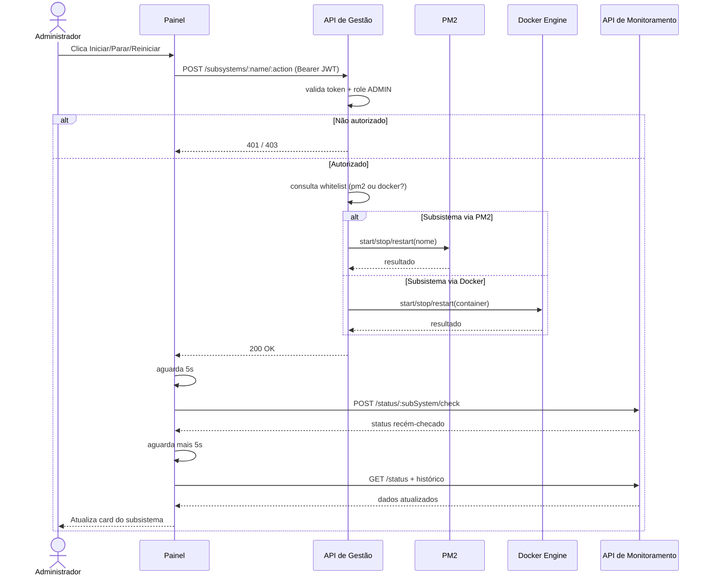

#### UC09 — Reiniciar a própria API de Gestão

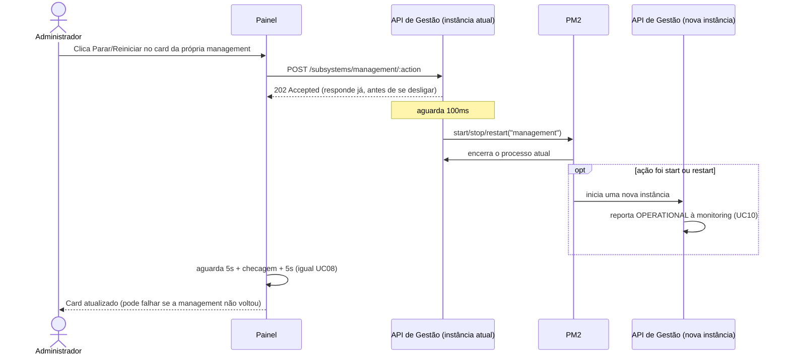

#### UC10 — Reportar o próprio status

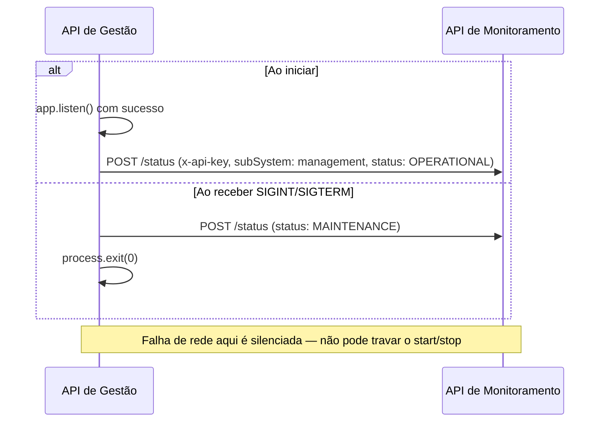

#### UC11 — Subir o ambiente completo

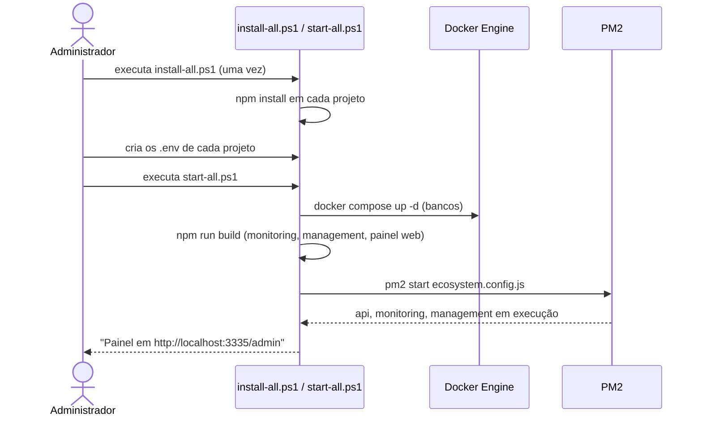

### Requisitos Não Funcionais

| Código | Requisito | Descrição |
|---|---|---|
| RNF09 | Whitelist fixa de subsistemas controláveis | Nenhum nome vindo do `body`/`params` pode virar comando arbitrário pro PM2 ou Docker — só os nomes conhecidos (`api`, `monitoring`, `management`, `database`, `monitoring-database`) são aceitos |
| RNF10 | Autorização por papel | Toda ação de start/stop/restart exige token JWT válido **e** `role: ADMIN`; um usuário comum autenticado recebe `403` mesmo com token válido |
| RNF11 | Resposta antes de efeito colateral irreversível | Ao agir sobre si mesma, a API de Gestão responde `202` antes de disparar o comando de restart/stop, evitando deixar a conexão HTTP pendente indefinidamente |
| RNF12 | Ausência de banco de dados próprio | A API de Gestão não mantém estado persistente próprio (sem schema/tabelas); autenticação é validada via JWT compartilhado com a Data API, e status é delegado à API de Monitoramento — reduz pontos únicos de falha adicionais |
| RNF13 | Portabilidade do acesso ao Docker | A conexão com o Docker Engine detecta automaticamente o sistema operacional (named pipe no Windows, socket Unix no Linux), sem configuração manual |
| RNF14 | Tecnologia | API REST em Node.js + TypeScript + Express; comunicação com PM2 via API programática (pacote `pm2`) e com Docker via `dockerode`; painel administrativo em React Native Web (Expo), servido como build estático pela própria API de Gestão em `/admin` |

---

## Cadastro de Organização (Data API)

> Diagrama de casos de uso convertido a partir de `Diagramas/DCU - Organização.asta` (Astah), unificado com o restante do documento a pedido do professor — a exportação em PNG já existente (`Diagramas/DCU - Organizações.png`) foi usada como referência exata pro conteúdo (o `.asta` em si é um binário Java serializado dentro de um ZIP, não abre como texto). O diagrama de classes correspondente está em `dicionario_de_dados.md`, seção "Cadastro de Organização, Comissão e Usuário".
>
> **Escopo desta seção**: só o diagrama de casos de uso foi convertido, que é o que existia no Astah. A descrição de cada caso de uso no formulário padrão, os diagramas de sequência e os requisitos não funcionais deste requisito ainda precisam ser preenchidos por quem o levantou — segue a mesma estrutura das seções acima quando isso for feito.

### Atores

| Ator | Tipo | Descrição |
|---|---|---|
| Usuário | Humano | Qualquer usuário cadastrado; pode solicitar a criação de uma organização |
| Administrador | Humano | Generaliza `Usuário` (todo Administrador também é um Usuário); único que aprova/recusa organizações e as gerencia |

### Diagrama de Casos de Uso

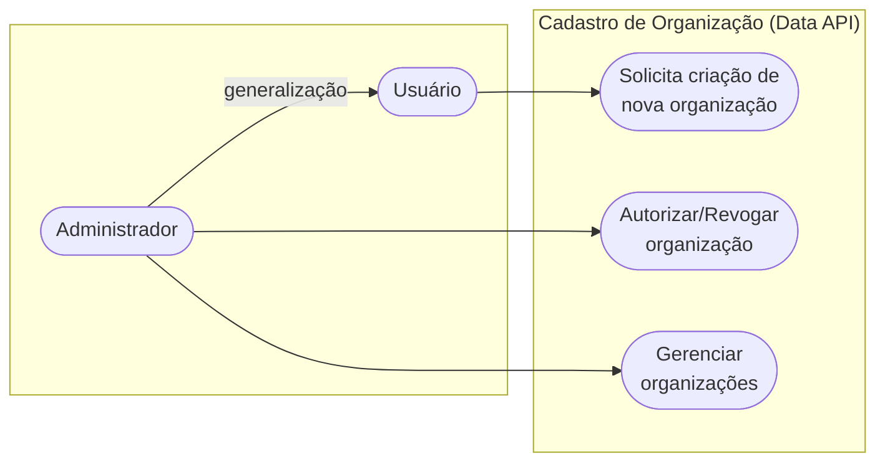
