# Requisitos e Casos de Uso — Entrega Di1

> Este arquivo é organizado por requisito. Cada seção `##` abaixo corresponde a um requisito do Incremento 1 e é de responsabilidade do membro da equipe que o levantou. Ao adicionar seu requisito, siga o mesmo formato: diagrama de casos de uso, descrição de cada caso de uso, diagrama de sequência e requisitos não funcionais.

---

## Informações do Sistema — Status do Sistema e dos Subsistemas (API de Monitoramento)

> Cobre apenas a parte de **status do sistema e dos seus subsistemas** do requisito "Informações do sistema" (slide 9), implementada pela `monitoring-better-meet`. As demais partes do requisito estão nas seções seguintes deste arquivo: reinicialização de subsistemas, setup inicial e reset do sistema em "Informações do Sistema — Reinicialização de Subsistemas, Setup Inicial e Reset" (`management-better-meet` + scripts de infraestrutura), e relatórios de usuários/organizações/comissões em "Informações do Sistema — Relatórios" (Data API + app mobile).

### Atores

| Ator | Tipo | Descrição |
|---|---|---|
| Usuário Autenticado | Humano (abstrato) | Generaliza os dois atores humanos abaixo — qualquer um com JWT válido pode consultar status (UC01–UC03) |
| Usuário do App Mobile | Humano | Usuário final do Better Meet; vê o status de 3 subsistemas (`mobile-app`, `data-api`, `database`) na tela "Status do sistema" (`better-meet/src/app/status.tsx`), com histórico dos últimos 30 dias |
| Administrador (Painel de Gestão) | Humano | Usuário técnico/admin que usa o painel web da `management-better-meet`; vê todos os 6 subsistemas, com histórico dos últimos 30 dias |
| Cron de Monitoramento | Automático / temporal | Job interno da própria API de monitoramento, roda a cada 3 horas sem intervenção humana |
| Sistema Externo | Sistema (abstrato) | Generaliza os três sistemas abaixo — qualquer um pode reportar status via `POST /status` com `x-api-key` (UC05) |
| App Mobile (Better Meet) | Sistema externo | O próprio aplicativo mobile, reportando seus próprios erros de execução (`reportMobileError`, subsistema `mobile-app`) |
| Painel de Gestão (web) | Sistema externo | Front-end da `management-better-meet` (`management-better-meet/web`); reporta os próprios erros como subsistema `management` e é quem de fato dispara a checagem sob demanda (UC06) depois de uma ação do Administrador |
| API de Gestão | Sistema externo | Back-end da `management-better-meet`; se auto-reporta ao iniciar (`OPERATIONAL`) e ao parar (`MAINTENANCE`) |

> **Observação sobre a Data API e a própria monitoring**: a Data API (`api`) possui um `monitoringReporter.ts`, mas hoje ele **não é chamado** em nenhum ponto — o status da Data API vem só das checagens (UC04/UC06). Já a API de Monitoramento registra o próprio início (`OPERATIONAL`, "Serviço iniciado") e parada (`MAINTENANCE`, "Parada solicitada") gravando direto no próprio banco, sem passar pelo `POST /status`.

### Diagrama de Casos de Uso

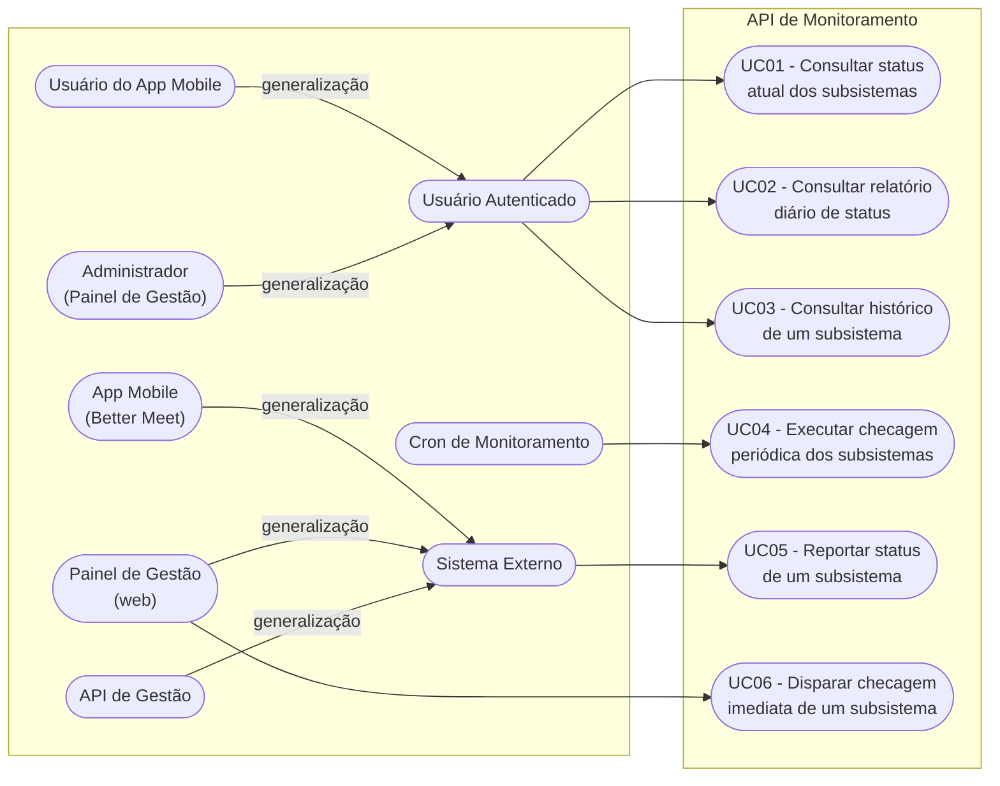
```mermaid
flowchart LR
    subgraph Atores[ ]
        direction TB
        AU(["Usuário Autenticado"])
        A1(["Usuário do App Mobile"])
        A2(["Administrador<br/>(Painel de Gestão)"])
        A3(["Cron de Monitoramento"])
        AS(["Sistema Externo"])
        A4(["App Mobile<br/>(Better Meet)"])
        A5(["Painel de Gestão<br/>(web)"])
        A6(["API de Gestão"])

        A1 -- generalização --> AU
        A2 -- generalização --> AU
        A4 -- generalização --> AS
        A5 -- generalização --> AS
        A6 -- generalização --> AS
    end

    subgraph SistemaMonitoramento["API de Monitoramento"]
        UC1(["UC01 - Consultar status<br/>atual dos subsistemas"])
        UC2(["UC02 - Consultar relatório<br/>diário de status"])
        UC3(["UC03 - Consultar histórico<br/>de um subsistema"])
        UC4(["UC04 - Executar checagem<br/>periódica dos subsistemas"])
        UC5(["UC05 - Reportar status<br/>de um subsistema"])
        UC6(["UC06 - Disparar checagem<br/>imediata de um subsistema"])
    end

    AU --> UC1
    AU --> UC2
    AU --> UC3
    A3 --> UC4
    AS --> UC5
    A5 --> UC6
```

### Descrição dos Casos de Uso

#### UC01 — Consultar status atual dos subsistemas

| Campo | Descrição |
|---|---|
| **Ator(es)** | Usuário do App Mobile, Administrador (Painel de Gestão) |
| **Descrição** | Permite ao ator visualizar o status mais recente registrado de cada subsistema monitorado |
| **Pré-condições** | Ator autenticado (JWT válido, obtido no login da Data API) |
| **Fluxo Principal** | 1. Ator abre a tela/painel de status. 2. Cliente envia `GET /monitoring-better-meet/status` com `Authorization: Bearer <token>`. 3. Sistema valida o token. 4. Sistema busca, para cada `SubSystem`, o `StatusCheck` mais recente. 5. Sistema retorna a lista (id, nome, status, mensagem, data/hora da última checagem). 6. Cliente exibe o status de cada subsistema. |
| **Fluxos Alternativos / Exceção** | 3a. Token ausente ou inválido → sistema retorna `401 Unauthorized`; cliente redireciona ao login. 4a. Subsistema sem nenhum `StatusCheck` ainda → retorna status `UNKNOWN`. |
| **Pós-condições** | Ator visualiza o status atual de cada subsistema ao qual tem acesso |

#### UC02 — Consultar relatório diário de status

| Campo | Descrição |
|---|---|
| **Ator(es)** | Usuário Autenticado (qualquer cliente com JWT válido) |
| **Descrição** | Permite consultar um resumo agregado (uptime e último status) de todos os subsistemas em um dia específico, junto com a lista das checagens daquele dia |
| **Pré-condições** | Ator autenticado (JWT válido) |
| **Fluxo Principal** | 1. Ator informa a data desejada (ou omite, e o dia atual é usado). 2. Cliente envia `GET /monitoring-better-meet/status/daily?date=YYYY-MM-DD` com Bearer token. 3. Sistema valida o token. 4. Sistema busca todas as checagens do dia (00:00 a 23:59, horário do servidor) por subsistema. 5. Sistema calcula `totalChecks`, `uptimePercentage` e `lastStatus` por subsistema. 6. Sistema retorna o relatório agregado, com a lista `checks` (status, mensagem, data/hora) de cada subsistema. |
| **Fluxos Alternativos / Exceção** | 2a. Data inválida no parâmetro → `400 Bad Request`. 3a. Token inválido → `401 Unauthorized`. 4a. Subsistema sem nenhuma checagem no dia → `totalChecks: 0`, `uptimePercentage: null`, `lastStatus: UNKNOWN`. |
| **Pós-condições** | Ator recebe o resumo do dia por subsistema |
| **Observação** | O endpoint está implementado e protegido, mas **nenhuma tela o consome hoje** — tanto o app mobile quanto o painel de gestão usam UC01 + UC03. Fica disponível para uso futuro ou consulta direta à API |

#### UC03 — Consultar histórico de um subsistema

| Campo | Descrição |
|---|---|
| **Ator(es)** | Usuário do App Mobile, Administrador (Painel de Gestão) |
| **Descrição** | Permite consultar a evolução do status de UM subsistema ao longo de N dias |
| **Pré-condições** | Ator autenticado (JWT válido); subsistema já existente na base |
| **Fluxo Principal** | 1. Ator abre a tela/painel de status; o cliente pede o histórico de cada subsistema exibido (as telas atuais usam 30 dias; se o parâmetro for omitido, a API usa 7). 2. Cliente envia `GET /monitoring-better-meet/status/:subSystemId/history?days=N` com Bearer token. 3. Sistema valida o token. 4. Sistema monta o "esqueleto" de todos os dias do período, em UTC (mesmo sem checagem). 5. Sistema preenche cada dia com `totalChecks`, `uptimePercentage`, `lastStatus` e `worstStatus`. 6. Sistema retorna o histórico. |
| **Fluxos Alternativos / Exceção** | 3a. Token inválido → `401 Unauthorized`. 2a. `subSystemId` não numérico ou zero → `400 Bad Request`. 2b. `subSystemId` não existe → `404 Not Found`. 5a. Dia sem nenhuma checagem → aparece no histórico com `totalChecks: 0` e `worstStatus: UNKNOWN`, útil para identificar "buracos" de monitoramento. |
| **Pós-condições** | Ator visualiza a linha do tempo de status do subsistema escolhido |

#### UC04 — Executar checagem periódica dos subsistemas

| Campo | Descrição |
|---|---|
| **Ator(es)** | Cron de Monitoramento (automático) |
| **Descrição** | A cada 3 horas (00h, 03h, 06h, 09h, 12h, 15h, 18h, 21h), o sistema verifica a saúde de cada subsistema e registra o resultado, sem intervenção humana |
| **Pré-condições** | Processo da API de monitoramento em execução |
| **Fluxo Principal** | 1. Agendador (`node-cron`, expressão `0 */3 * * *`) dispara o job. 2. Sistema executa, em paralelo, uma checagem por subsistema: `database` (conexão direta MySQL, `SELECT 1`), `data-api` e `management` (`GET /health`), `monitoring-database` (query no próprio Prisma), `monitoring` (sempre operacional, se o cron rodou o processo está de pé) e `mobile-app` (verifica se não há `ERROR`, `DOWN` ou `MAINTENANCE` reportado nas últimas 6h). 3. Cada checagem grava um `StatusCheck` (status `OPERATIONAL` ou `DOWN`, com a mensagem de erro se houver). |
| **Fluxos Alternativos / Exceção** | 2a. Falha ao conectar/checar um subsistema (timeout de 5s, conexão recusada, `/health` com status diferente de 2xx) → grava `DOWN` com a mensagem do erro, sem interromper as demais checagens (isoladas via `Promise.all` + try/catch individual). 2b. `mobile-app` com `ERROR`/`DOWN`/`MAINTENANCE` reportado nas últimas 6h → **não** grava `OPERATIONAL`, para não mascarar o erro recém-reportado. |
| **Pós-condições** | Histórico de status atualizado para todos os subsistemas, disponível para consulta (UC01–UC03) |

#### UC05 — Reportar status de um subsistema

| Campo | Descrição |
|---|---|
| **Ator(es)** | App Mobile (Better Meet), Painel de Gestão (web), API de Gestão |
| **Descrição** | Permite que um sistema externo registre, ele mesmo, um evento de status (ex.: erro capturado no app ou no painel, ou "estou operacional" ao subir) |
| **Pré-condições** | Ator possui a `x-api-key` válida configurada (`INTERNAL_API_KEY` / `EXPO_PUBLIC_MONITORING_API_KEY`, geradas pelo `start-all.ps1`) |
| **Fluxo Principal** | 1. Ator captura um evento: erro no app mobile (`subSystem: mobile-app`, status `ERROR` ou `DOWN`), erro no painel web (`subSystem: management`), ou início/parada da API de Gestão (`OPERATIONAL` / `MAINTENANCE`). 2. Ator envia `POST /monitoring-better-meet/status` com header `x-api-key` e corpo `{ subSystem, status, message?, isBlocking? }`. 3. Sistema valida a `x-api-key` (comparação em tempo constante). 4. Sistema cria o `SubSystem` automaticamente se ainda não existir (upsert). 5. Sistema grava o `StatusCheck`. 6. Sistema retorna `201 Created` com o registro criado. |
| **Fluxos Alternativos / Exceção** | 3a. `x-api-key` ausente ou inválida → `401 Unauthorized`. 2a. `subSystem` ou `status` ausentes, ou `status` fora do enum → `400 Bad Request`. 1a. App mobile e painel web limitam o envio a 1 relatório a cada 5s (evita inundar a monitoring com erros repetidos); falha de rede ao reportar é ignorada silenciosamente para não gerar um loop de erros. |
| **Pós-condições** | Novo `StatusCheck` disponível no histórico do subsistema |

#### UC06 — Disparar checagem imediata de um subsistema

| Campo | Descrição |
|---|---|
| **Ator(es)** | Painel de Gestão (web, `management-better-meet/web`); também usado pelo `start-all.ps1` no setup inicial (UC11) |
| **Descrição** | Permite forçar a checagem de UM subsistema fora do horário do cron — usado depois de start/stop/restart de um serviço, para o painel refletir a mudança sem esperar até 3h |
| **Pré-condições** | Ator possui a `x-api-key` válida; subsistema informado é um dos 6 conhecidos pelo sistema |
| **Fluxo Principal** | 1. Administrador executa uma ação no painel (UC08) e o painel aguarda 5s. 2. Painel envia `POST /monitoring-better-meet/status/:subSystem/check` com `x-api-key`. 3. Sistema valida a `x-api-key`. 4. Sistema executa, imediatamente, a checagem correspondente àquele subsistema (mesma lógica do UC04, mas só para um). 5. Sistema grava o `StatusCheck` resultante. 6. Sistema retorna o status mais recente do subsistema. |
| **Fluxos Alternativos / Exceção** | 3a. `x-api-key` inválida → `401 Unauthorized`. 2a. Nome de subsistema desconhecido → `404 Not Found`. |
| **Pós-condições** | Status do subsistema atualizado imediatamente, refletido nas próximas consultas (UC01) |

### Diagramas de Sequência

#### UC01 — Consultar status atual

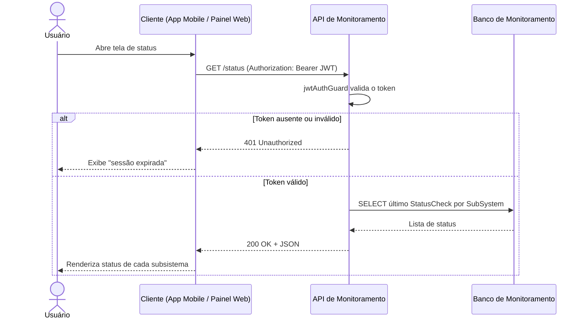
```mermaid
sequenceDiagram
    actor U as Usuário
    participant App as Cliente (App Mobile / Painel Web)
    participant Mon as API de Monitoramento
    participant DB as Banco de Monitoramento

    U->>App: Abre tela de status
    App->>Mon: GET /status (Authorization: Bearer JWT)
    Mon->>Mon: jwtAuthGuard valida o token
    alt Token ausente ou inválido
        Mon-->>App: 401 Unauthorized
        App-->>U: Exibe "sessão expirada"
    else Token válido
        Mon->>DB: SELECT último StatusCheck por SubSystem
        DB-->>Mon: Lista de status
        Mon-->>App: 200 OK + JSON
        App-->>U: Renderiza status de cada subsistema
    end
```

#### UC02 — Consultar relatório diário

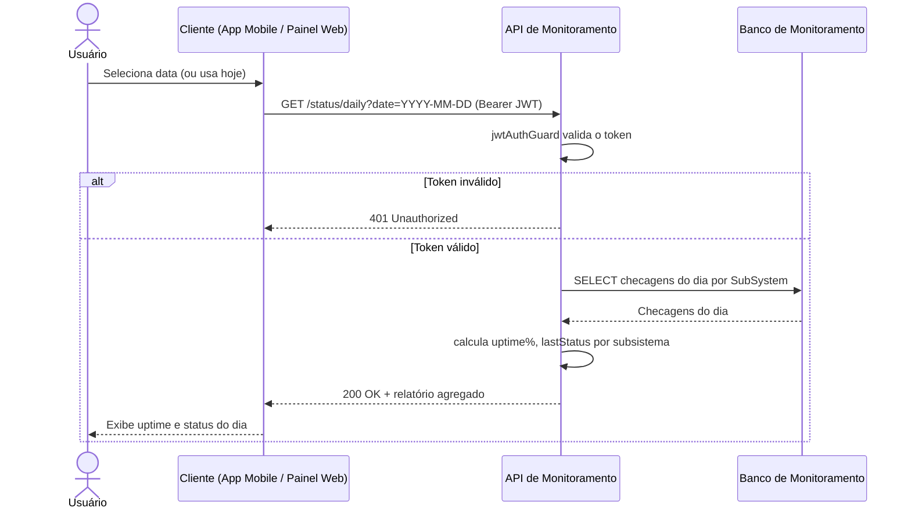
```mermaid
sequenceDiagram
    actor U as Usuário
    participant App as Cliente (App Mobile / Painel Web)
    participant Mon as API de Monitoramento
    participant DB as Banco de Monitoramento

    U->>App: Seleciona data (ou usa hoje)
    App->>Mon: GET /status/daily?date=YYYY-MM-DD (Bearer JWT)
    Mon->>Mon: jwtAuthGuard valida o token
    alt Token inválido
        Mon-->>App: 401 Unauthorized
    else Token válido
        Mon->>DB: SELECT checagens do dia por SubSystem
        DB-->>Mon: Checagens do dia
        Mon->>Mon: calcula uptime%, lastStatus por subsistema
        Mon-->>App: 200 OK + relatório agregado
        App-->>U: Exibe uptime e status do dia
    end
```

#### UC03 — Consultar histórico de um subsistema

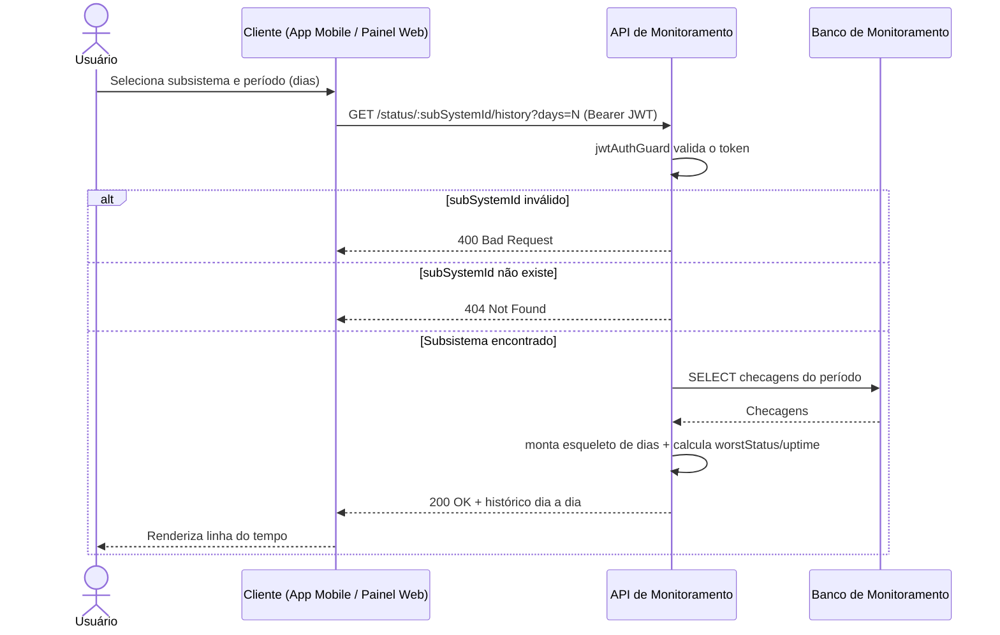
```mermaid
sequenceDiagram
    actor U as Usuário
    participant App as Cliente (App Mobile / Painel Web)
    participant Mon as API de Monitoramento
    participant DB as Banco de Monitoramento

    U->>App: Seleciona subsistema e período (dias)
    App->>Mon: GET /status/:subSystemId/history?days=N (Bearer JWT)
    Mon->>Mon: jwtAuthGuard valida o token
    alt subSystemId inválido
        Mon-->>App: 400 Bad Request
    else subSystemId não existe
        Mon-->>App: 404 Not Found
    else Subsistema encontrado
        Mon->>DB: SELECT checagens do período
        DB-->>Mon: Checagens
        Mon->>Mon: monta esqueleto de dias + calcula worstStatus/uptime
        Mon-->>App: 200 OK + histórico dia a dia
        App-->>U: Renderiza linha do tempo
    end
```

#### UC04 — Executar checagem periódica

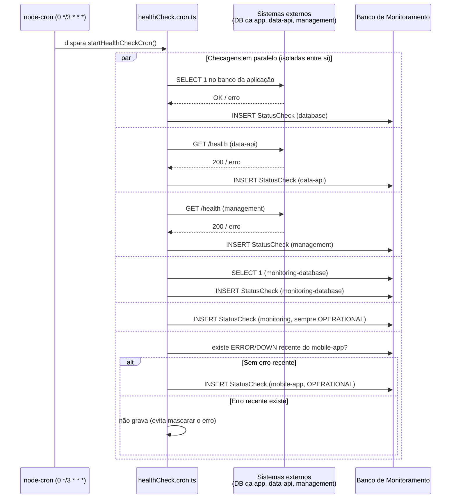
```mermaid
sequenceDiagram
    participant Cron as node-cron (0 */3 * * *)
    participant Job as healthCheck.cron.ts
    participant Ext as Sistemas externos<br/>(DB da app, data-api, management)
    participant DB as Banco de Monitoramento

    Cron->>Job: dispara startHealthCheckCron()
    par Checagens em paralelo (isoladas entre si)
        Job->>Ext: SELECT 1 no banco da aplicação
        Ext-->>Job: OK / erro
        Job->>DB: INSERT StatusCheck (database)
    and
        Job->>Ext: GET /health (data-api)
        Ext-->>Job: 200 / erro
        Job->>DB: INSERT StatusCheck (data-api)
    and
        Job->>Ext: GET /health (management)
        Ext-->>Job: 200 / erro
        Job->>DB: INSERT StatusCheck (management)
    and
        Job->>DB: SELECT 1 (monitoring-database)
        Job->>DB: INSERT StatusCheck (monitoring-database)
    and
        Job->>DB: INSERT StatusCheck (monitoring, sempre OPERATIONAL)
    and
        Job->>DB: existe ERROR/DOWN recente do mobile-app?
        alt Sem erro recente
            Job->>DB: INSERT StatusCheck (mobile-app, OPERATIONAL)
        else Erro recente existe
            Job->>Job: não grava (evita mascarar o erro)
        end
    end
```

#### UC05 — Reportar status de um subsistema

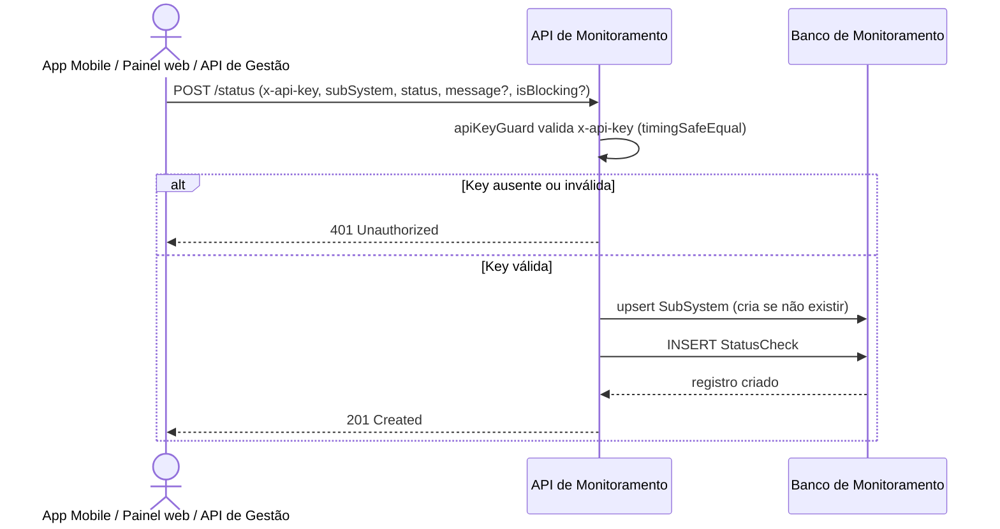
```mermaid
sequenceDiagram
    actor Sist as App Mobile / Painel web / API de Gestão
    participant Mon as API de Monitoramento
    participant DB as Banco de Monitoramento

    Sist->>Mon: POST /status (x-api-key, subSystem, status, message?, isBlocking?)
    Mon->>Mon: apiKeyGuard valida x-api-key (timingSafeEqual)
    alt Key ausente ou inválida
        Mon-->>Sist: 401 Unauthorized
    else Key válida
        Mon->>DB: upsert SubSystem (cria se não existir)
        Mon->>DB: INSERT StatusCheck
        DB-->>Mon: registro criado
        Mon-->>Sist: 201 Created
    end
```

#### UC06 — Disparar checagem imediata

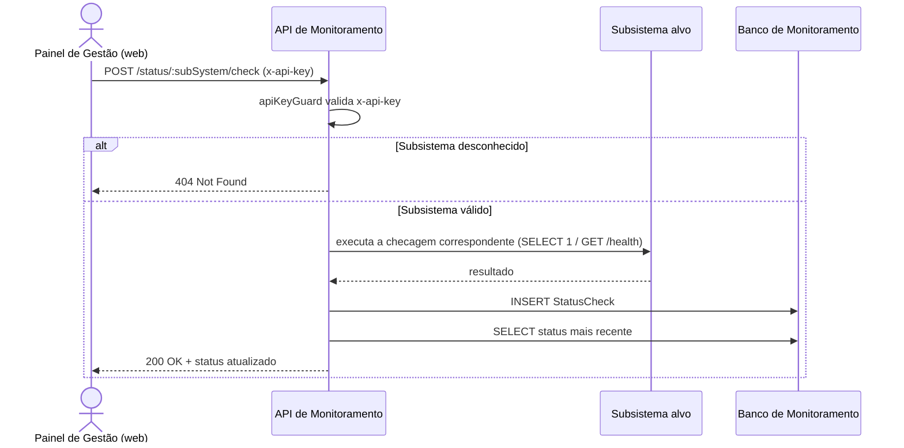
```mermaid
sequenceDiagram
    actor Adm as Painel de Gestão (web)
    participant Mon as API de Monitoramento
    participant Ext as Subsistema alvo
    participant DB as Banco de Monitoramento

    Adm->>Mon: POST /status/:subSystem/check (x-api-key)
    Mon->>Mon: apiKeyGuard valida x-api-key
    alt Subsistema desconhecido
        Mon-->>Adm: 404 Not Found
    else Subsistema válido
        Mon->>Ext: executa a checagem correspondente (SELECT 1 / GET /health)
        Ext-->>Mon: resultado
        Mon->>DB: INSERT StatusCheck
        Mon->>DB: SELECT status mais recente
        Mon-->>Adm: 200 OK + status atualizado
    end
```

### Requisitos Não Funcionais

| Código | Requisito | Descrição |
|---|---|---|
| RNF13 | Periodicidade das checagens automáticas | O sistema deve verificar a saúde dos subsistemas a cada 3 horas (00h, 03h, 06h, 09h, 12h, 15h, 18h, 21h), sem intervenção manual |
| RNF14 | Isolamento de falhas entre checagens | A falha em checar um subsistema não pode impedir a checagem dos demais (checagens executadas em paralelo, cada uma com seu próprio tratamento de erro) |
| RNF15 | Timeout de checagens externas | Toda chamada de rede a um subsistema externo deve ter timeout de 5 segundos, para não travar o ciclo do cron indefinidamente |
| RNF16 | Autenticação diferenciada por tipo de acesso | Rotas de leitura (consulta de status) exigem token JWT de usuário autenticado; rotas de escrita (registrar/forçar checagem) exigem chave de API própria para comunicação entre serviços |
| RNF17 | Comparação seguro de credenciais | A validação da chave de API deve ser feita em tempo constante (`crypto.timingSafeEqual`), para não expor a chave a ataques de timing |
| RNF18 | Isolamento de infraestrutura | O banco de dados de monitoramento deve rodar em um container/instância separada do banco da aplicação, para que uma falha no banco da aplicação não derrube também o monitoramento |
| RNF19 | Retenção histórica | Registros de status (`StatusCheck`) não são sobrescritos nem apagados automaticamente — cada checagem gera um novo registro, preservando o histórico completo para cálculo de uptime e auditoria |
| RNF20 | Tecnologia | API REST implementada em Node.js + TypeScript + Express, com Prisma ORM sobre MySQL 8.4, containerizado via Docker |

---

## Informações do Sistema — Reinicialização de Subsistemas, Setup Inicial e Reset (API de Gestão e Infraestrutura)

> Cobre as partes de **reinicialização de subsistemas** (painel + `management-better-meet`), **setup inicial e inicialização do sistema** (`start-all.ps1`) e **reset do sistema** (procedimento operacional com PM2 + Docker) do requisito "Informações do sistema" (slide 9). A parte de "status do sistema e dos subsistemas" está documentada na seção anterior (API de Monitoramento), e a de "relatórios de usuários/organizações/comissões" na seção seguinte (Relatórios).

### Atores

| Ator | Tipo | Descrição |
|---|---|---|
| Administrador (Painel de Gestão) | Humano, primário | Único ator autorizado a agir sobre os subsistemas pelo painel; precisa de conta com `role: ADMIN` na Data API. No primeiro setup, a conta padrão `admin@bettermeet.com` / `Admin123!` é criada automaticamente pela Data API ao subir |
| Administrador do Servidor | Humano, primário | Pessoa com acesso direto à máquina (terminal); executa o setup inicial (UC11) e o reset do sistema (UC12), que não são ações do painel |
| PM2 | Sistema externo, **secundário** | Gerenciador de processos Node.js — controla de fato `api`, `monitoring` e a própria `management`; participa como consequência de UC08/UC09/UC11/UC12, não os inicia |
| Docker Engine | Sistema externo, **secundário** | Controla os containers e volumes dos dois bancos (`mysql_better_meet_dev`, `mysql_monitoring_better_meet_dev`); participa como consequência de UC08/UC11/UC12, não os inicia |
| API de Monitoramento | Sistema externo, **secundário** | Recebe o auto-report de status da `management` (UC10) e as checagens sob demanda disparadas pelo painel após UC08/UC09 e pelo `start-all.ps1` no UC11; participa como consequência, não inicia nenhum caso de uso |

### Diagrama de Casos de Uso

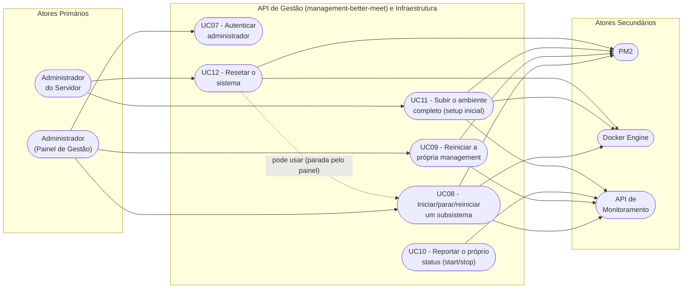
```mermaid
%%{init: {'flowchart': {'nodeSpacing': 45, 'rankSpacing': 110}}}%%
flowchart LR
    subgraph AtoresPrimarios["Atores Primários"]
        direction TB
        A1(["Administrador<br/>(Painel de Gestão)"])
        A0(["Administrador<br/>do Servidor"])
    end

    subgraph SistemaGestao["API de Gestão (management-better-meet) e Infraestrutura"]
        UC07(["UC07 - Autenticar<br/>administrador"])
        UC08(["UC08 - Iniciar/parar/reiniciar<br/>um subsistema"])
        UC09(["UC09 - Reiniciar a<br/>própria management"])
        UC10(["UC10 - Reportar o próprio<br/>status (start/stop)"])
        UC11(["UC11 - Subir o ambiente<br/>completo (setup inicial)"])
        UC12(["UC12 - Resetar o<br/>sistema"])
    end

    subgraph AtoresSecundarios["Atores Secundários"]
        direction TB
        A2(["PM2"])
        A3(["Docker Engine"])
        A4(["API de<br/>Monitoramento"])
    end

    A1 --> UC07
    A1 --> UC08
    A1 --> UC09
    A0 --> UC11
    A0 --> UC12
    UC12 -. "pode usar (parada pelo painel)" .-> UC08

    UC08 --> A2
    UC08 --> A3
    UC08 --> A4
    UC09 --> A2
    UC09 --> A4
    UC10 --> A4
    UC11 --> A2
    UC11 --> A3
    UC11 --> A4
    UC12 --> A2
    UC12 --> A3
```

### Descrição dos Casos de Uso

#### UC07 — Autenticar administrador

| Campo | Descrição |
|---|---|
| **Ator(es)** | Administrador (Painel de Gestão) |
| **Descrição** | Permite que um usuário com `role: ADMIN` acesse o painel de gestão; usuários comuns são bloqueados mesmo com credenciais válidas |
| **Pré-condições** | Usuário possui conta cadastrada na Data API |
| **Fluxo Principal** | 1. Administrador informa usuário/e-mail e senha na tela de login do painel. 2. Painel envia `POST /login` para a Data API. 3. Data API valida as credenciais e retorna `{ id, name, email, role, token }` (JWT válido por 7 dias). 4. Painel verifica se `role === 'ADMIN'`. 5. Painel guarda o token (persistido via AsyncStorage) e libera o acesso ao painel. |
| **Fluxos Alternativos / Exceção** | 3a. Credenciais inválidas → `401 Unauthorized`; exibe mensagem, não reporta como erro de sistema (é comportamento normal do usuário). 4a. `role !== 'ADMIN'` → acesso negado pelo próprio painel ("Este painel é restrito a administradores"), mesmo com login válido. 2a. Falha de rede ao contatar a Data API → reporta erro à monitoring (`subSystem: management`) e exibe mensagem de falha de conexão. |
| **Pós-condições** | Administrador autenticado, com token válido para as demais operações do painel |

#### UC08 — Iniciar, parar ou reiniciar um subsistema

| Campo | Descrição |
|---|---|
| **Ator(es)** | Administrador (Painel de Gestão), PM2, Docker Engine, API de Monitoramento |
| **Descrição** | Permite ao administrador controlar o ciclo de vida de qualquer subsistema (`api`, `monitoring`, `database`, `monitoring-database`) a partir do painel, sem precisar de acesso direto ao servidor |
| **Pré-condições** | Administrador autenticado (UC07); a própria API de Gestão está operacional |
| **Fluxo Principal** | 1. Administrador clica em Iniciar/Parar/Reiniciar num card do painel. 2. Painel envia `POST /subsystems/:name/:action` com `Authorization: Bearer <token>`. 3. Sistema valida o token e exige `role: ADMIN`. 4. Sistema consulta a whitelist interna pra saber se o alvo é controlado via PM2 (`api`, `monitoring`) ou via Docker (`database`, `monitoring-database`). 5a. Se PM2: conecta ao daemon do PM2 e executa `start`/`stop`/`restart` pelo nome do processo. 5b. Se Docker: usa a API do Docker Engine (named pipe no Windows / socket Unix no Linux) pra executar a mesma ação no container. 6. Sistema retorna `200 OK`. 7. Painel aguarda 5s, pede à API de Monitoramento pra checar aquele subsistema agora (checagem imediata), aguarda mais 5s, e então atualiza status e histórico na tela. |
| **Fluxos Alternativos / Exceção** | 3a. Token ausente/inválido → `401`; papel diferente de ADMIN → `403`. 2a. Ação diferente de `start`, `stop` ou `restart` → `400 Bad Request`. 4a. Nome de subsistema fora da whitelist → `404 Not Found` (nenhum comando arbitrário chega ao PM2/Docker). 4b. O card "Aplicativo (Better Meet)" do painel só exibe status — o app mobile não é um processo do servidor, então não tem botões de ação. 5a. Falha ao executar a ação (processo/container não existe, Docker inacessível) → `500`; painel reporta o erro à monitoring e mantém os botões habilitados pra nova tentativa. Ação sobre `management` → segue o fluxo especial do UC09, não este. |
| **Pós-condições** | Subsistema no novo estado solicitado; painel refletindo o status atualizado após o intervalo de checagem |

#### UC09 — Reiniciar a própria API de Gestão

| Campo | Descrição |
|---|---|
| **Ator(es)** | Administrador (Painel de Gestão), PM2 |
| **Descrição** | Caso especial do UC08: como a própria API de Gestão é quem processaria o pedido, ela precisa responder antes de se desligar — senão a conexão HTTP nunca receberia resposta |
| **Pré-condições** | Administrador autenticado; API de Gestão operacional (pra receber o pedido) |
| **Fluxo Principal** | 1. Administrador clica em Parar/Reiniciar no card "API de Gestão (esta)". 2. Painel envia `POST /subsystems/management/:action`. 3. Sistema responde imediatamente `202 Accepted`. 4. Depois de um pequeno atraso (100ms), sistema pede ao PM2 pra executar a ação sobre o próprio processo. 5. PM2 encerra o processo atual e, se a ação foi `start`/`restart`, sobe uma nova instância. 6. A nova instância reporta `OPERATIONAL` à monitoring ao subir (UC10). |
| **Fluxos Alternativos / Exceção** | 4a. Se a ação falhar depois do `202` já enviado, o erro só é registrado no log do servidor — o painel não recebe essa falha diretamente. Enquanto a própria `management` está fora do ar (ação `stop`, ou falha ao voltar), **nenhuma** ação de nenhum subsistema funciona pelo painel — inclusive religá-la de volta —, porque é ela quem serve o próprio painel e a API que executa as ações. Recuperação nesse caso é manual (`pm2 start management` direto no servidor). |
| **Pós-condições** | API de Gestão no novo estado; se ficou de pé, o painel volta a responder normalmente em poucos segundos |

#### UC10 — Reportar o próprio status ao iniciar ou parar

| Campo | Descrição |
|---|---|
| **Ator(es)** | API de Gestão (automático), API de Monitoramento |
| **Descrição** | A API de Gestão se auto-reporta à monitoring nos dois extremos do seu ciclo de vida, pra refletir mudanças de estado sem esperar o próximo ciclo do cron (a cada 3h) |
| **Pré-condições** | `MONITORING_API_URL` e `INTERNAL_API_KEY` configurados no `.env` da `management` |
| **Fluxo Principal** | 1a. Ao subir e começar a escutar na porta, sistema envia `POST /monitoring-better-meet/status` com `subSystem: "management"`, `status: "OPERATIONAL"`. 1b. Ao receber `SIGINT`/`SIGTERM` (comando de parada do PM2, inclusive o do próprio UC09), sistema envia o mesmo POST com `status: "MAINTENANCE"` **antes** de efetivamente sair do processo. |
| **Fluxos Alternativos / Exceção** | Falha de rede ao reportar → erro é silenciado (log local), não pode travar o start/stop da `management` por causa disso; timeout curto (1.5s) no report de parada, porque o PM2 mata o processo à força (~1.6s) se ele não sair rápido o suficiente. |
| **Pós-condições** | Monitoring com o status mais recente da `management`, sem depender do cron |

#### UC11 — Subir o ambiente completo (setup inicial)

| Campo | Descrição |
|---|---|
| **Ator(es)** | Administrador do Servidor (acesso direto ao servidor, fora do painel web), PM2, Docker Engine, API de Monitoramento |
| **Descrição** | Prepara e inicializa todos os subsistemas de uma vez, com um único script (`sistema/start-all.ps1`), numa máquina nova, depois de uma parada total ou depois de um reset (UC12) — não é uma ação do painel |
| **Pré-condições** | Node.js e Docker Desktop instalados e em execução na máquina (únicos pré-requisitos não automatizados, por segurança) |
| **Fluxo Principal** | 1. Administrador executa `.\start-all.ps1` na pasta `sistema`. 2. Script verifica o `pm2` e, se não existir, instala globalmente (`npm install -g pm2`). 3. Script roda `npm install` em `api`, `better-meet`, `monitoring-better-meet`, `management-better-meet/server` e `management-better-meet/web`, conferindo se o Prisma instalado é exatamente a versão `7.10.0` em `api` e `monitoring-better-meet`. 4. Script cria cada `.env` a partir do `.env.example` (ou corrige o existente): gera **um único** `JWT_SECRET` e **uma única** chave de API interna (`INTERNAL_API_KEY` / `EXPO_PUBLIC_MONITORING_API_KEY`) reaproveitados em todos os projetos, e troca `localhost`/`SEU_IP_AQUI` pelo IP da máquina na rede (para o app no celular físico alcançar as APIs). 5. Script sobe os bancos com `docker compose up -d` (cria containers e volumes na primeira vez, só inicia depois) e aguarda cada MySQL responder (`mysqladmin ping`, até 60s). 6. Script compara o schema do Prisma com o banco (`prisma migrate diff`) em `api` e `monitoring-better-meet`, roda `prisma db push` só se houver divergência, e gera o Prisma Client. 7. Script builda `monitoring-better-meet` e `management-better-meet/server` e sobe `api`, `monitoring` e `management` com `pm2 start ecosystem.config.js`. 8. Ao subir, a Data API garante a existência do administrador padrão (`admin@bettermeet.com` / `Admin123!`). 9. Script aguarda `/health` da `api` e da `monitoring`, faz login como administrador padrão e, para cada um dos 6 subsistemas sem nenhum registro, grava um status inicial `UNKNOWN` (UC05) e em seguida dispara a checagem real de cada um (UC06). 10. Script builda o painel web (`npm run export:web`), que passa a ser servido pela própria `management` em `/admin`, e exibe o endereço `http://<IP>:3335/admin`. |
| **Fluxos Alternativos / Exceção** | 2a. Falha ao instalar o `pm2` → script aborta e orienta a instalação manual. 3a. `npm install` falha ou a versão do Prisma diverge de `7.10.0` → script aborta indicando o projeto. 4a. IP da rede não detectado → usa `localhost` só onde ainda não há IP configurado, avisando que o app num celular físico não vai conseguir conectar. 5a. MySQL não responde em 60s → aviso; a sincronização do Prisma pode falhar. 9a. `api` ou `monitoring` não respondem em 30s, ou o login/semente falha → etapa é pulada com aviso (não bloqueante); o painel mostra "Sem monitoramento ainda" até a próxima checagem. Rodar `start-all.ps1` de novo é seguro (idempotente): não duplica container, preserva `.env` e segredos já válidos, e o PM2 apenas reinicia o que já estava rodando. |
| **Pós-condições** | Os cinco subsistemas de servidor (`api`, `monitoring`, `management` e os dois bancos) em execução, com status inicial registrado na monitoring; painel administrativo acessível em `/admin` |

#### UC12 — Resetar o sistema

| Campo | Descrição |
|---|---|
| **Ator(es)** | Administrador do Servidor (acesso direto ao servidor), PM2, Docker Engine; opcionalmente Administrador (Painel de Gestão) para a etapa de parada |
| **Descrição** | Procedimento operacional (não há endpoint nem botão de "reset" no sistema) para encerrar todos os subsistemas e, se desejado, apagar completamente os dados da aplicação e do monitoramento, voltando o sistema ao estado de primeira instalação. Opcionalmente, os dados podem ser salvos antes, a partir dos volumes definidos no `docker-compose.yml` |
| **Pré-condições** | Acesso ao terminal da máquina onde o sistema roda (PM2 e Docker instalados); para usar o painel na etapa de parada, Administrador autenticado (UC07) |
| **Fluxo Principal** | **Etapa 1 — Encerrar os subsistemas.** 1. Administrador encerra os processos Node pelo PM2: `pm2 stop api monitoring management` (ou `pm2 stop all`). **Alternativa pelo painel de gestão**: usar "Parar" (UC08) nos cards "API de Dados", "API de Monitoramento", "Banco de Dados (app)" e "Banco de Dados (monitoring)", e por **último** no card "API de Gestão (esta)" (UC09) — depois disso o painel deixa de responder. 2. Administrador confere com `pm2 list` que os três processos estão `stopped`. 3. *(Opcional, para remover os processos da lista do PM2)* `pm2 delete api monitoring management`. **Etapa 2 — Backup (opcional, recomendado).** 4. Com os bancos parados (`docker compose stop`, na pasta `sistema`), Administrador copia o conteúdo de cada volume para um arquivo compactado. Exemplo (PowerShell, na pasta `sistema`): `docker run --rm -v sistema_db_better_meet_data:/data -v ${PWD}/backup:/backup alpine tar czf /backup/db_better_meet_data.tar.gz -C /data .` `docker run --rm -v sistema_db_monitoring_better_meet_data:/data -v ${PWD}/backup:/backup alpine tar czf /backup/db_monitoring_better_meet_data.tar.gz -C /data .` **Etapa 3 — Apagar os dados (reset completo).** 5. Administrador remove containers **e** volumes: `docker compose down -v` (na pasta `sistema`). 6. Administrador confere com `docker volume ls` que os volumes `sistema_db_better_meet_data` e `sistema_db_monitoring_better_meet_data` não existem mais. **Etapa 4 — Reinicializar.** 7. Administrador executa `.\start-all.ps1` (UC11), que recria containers, volumes, tabelas (via Prisma), o administrador padrão e o status inicial dos subsistemas. |
| **Fluxos Alternativos / Exceção** | 1a. Se a `management` for parada antes dos demais pelo painel, o painel para de responder e o restante tem que ser parado pelo terminal (PM2/Docker). 5a. **Reset só dos containers, sem apagar dados**: `docker compose down` (sem `-v`) remove os containers mas **mantém os volumes** — ao rodar `start-all.ps1` de novo, os bancos voltam com todos os dados. Apagar só os containers **não** reseta os dados. 5b. Reset de apenas um banco: parar o container e remover só o volume correspondente (`docker rm -f mysql_better_meet_dev` + `docker volume rm sistema_db_better_meet_data`, ou o par da monitoring). 4a. O prefixo `sistema_` do nome dos volumes vem do nome do projeto do Docker Compose (a pasta onde está o `docker-compose.yml`); se o projeto tiver sido criado com outro nome, conferir o nome real com `docker volume ls` antes do backup/remoção. **Restauração de um backup**: com o volume recriado e o container parado, `docker run --rm -v sistema_db_better_meet_data:/data -v ${PWD}/backup:/backup alpine sh -c "rm -rf /data/* && tar xzf /backup/db_better_meet_data.tar.gz -C /data"`, e então `.\start-all.ps1`. O backup deve ser restaurado na mesma versão do MySQL (`mysql:8.4.0`). |
| **Pós-condições** | Todos os subsistemas encerrados; se executada a Etapa 3, bancos da aplicação e do monitoramento sem nenhum dado (usuários, organizações, comissões e histórico de status apagados). Após a Etapa 4, sistema no estado de primeira instalação, apenas com o administrador padrão. Os arquivos `.env` **não** são apagados — segredos e configurações continuam valendo |

### Diagramas de Sequência

#### UC07 — Autenticar administrador

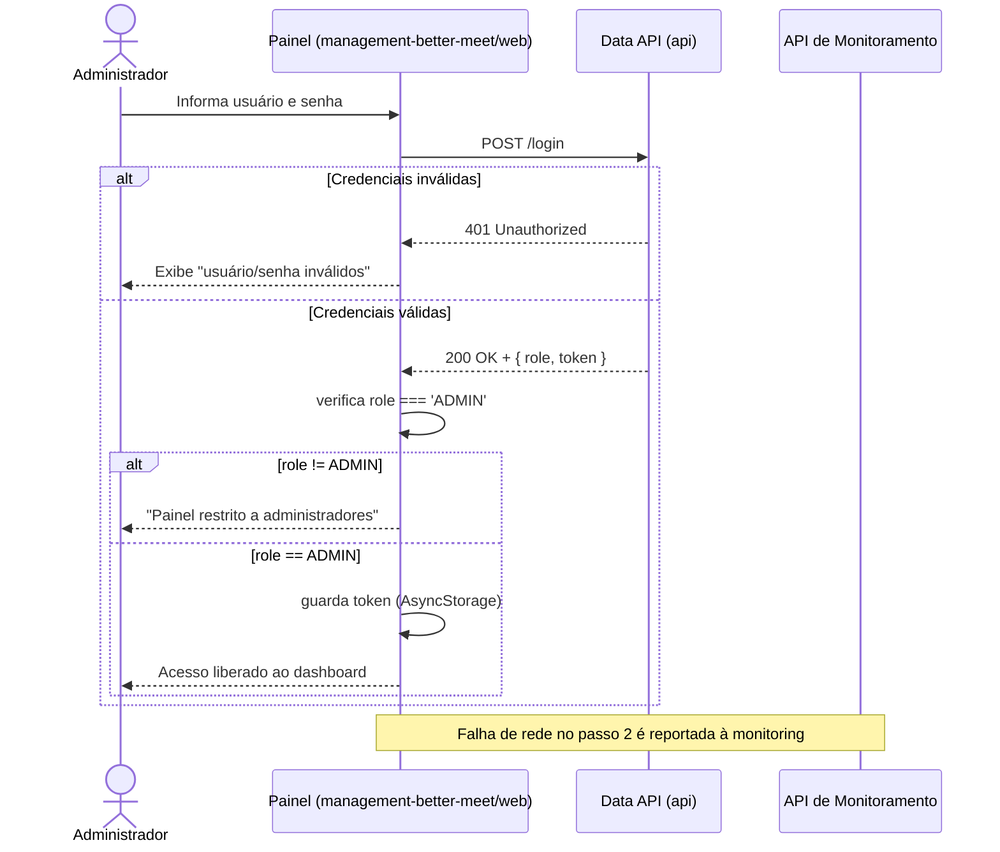
```mermaid
sequenceDiagram
    actor Adm as Administrador
    participant Web as Painel (management-better-meet/web)
    participant Api as Data API (api)
    participant Mon as API de Monitoramento

    Adm->>Web: Informa usuário e senha
    Web->>Api: POST /login
    alt Credenciais inválidas
        Api-->>Web: 401 Unauthorized
        Web-->>Adm: Exibe "usuário/senha inválidos"
    else Credenciais válidas
        Api-->>Web: 200 OK + { role, token }
        Web->>Web: verifica role === 'ADMIN'
        alt role != ADMIN
            Web-->>Adm: "Painel restrito a administradores"
        else role == ADMIN
            Web->>Web: guarda token (AsyncStorage)
            Web-->>Adm: Acesso liberado ao dashboard
        end
    end
    Note over Web,Mon: Falha de rede no passo 2 é reportada à monitoring
```

#### UC08 — Iniciar, parar ou reiniciar um subsistema

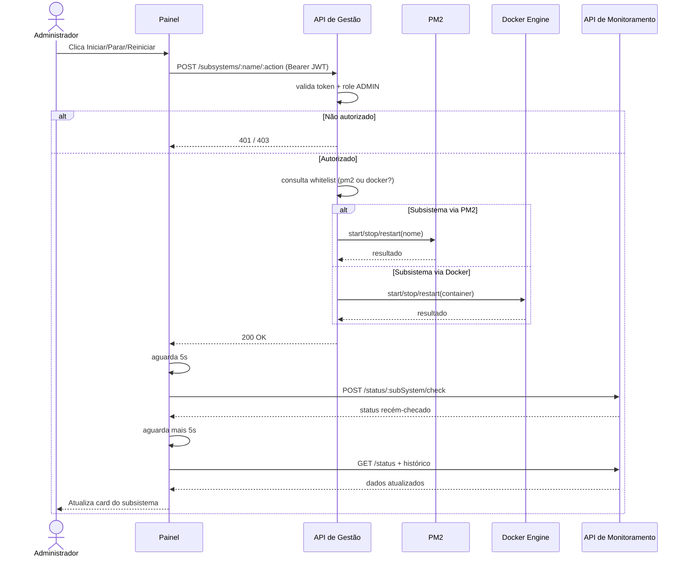
```mermaid
sequenceDiagram
    actor Adm as Administrador
    participant Web as Painel
    participant Mgmt as API de Gestão
    participant PM2 as PM2
    participant Docker as Docker Engine
    participant Mon as API de Monitoramento

    Adm->>Web: Clica Iniciar/Parar/Reiniciar
    Web->>Mgmt: POST /subsystems/:name/:action (Bearer JWT)
    Mgmt->>Mgmt: valida token + role ADMIN
    alt Não autorizado
        Mgmt-->>Web: 401 / 403
    else Autorizado
        Mgmt->>Mgmt: consulta whitelist (pm2 ou docker?)
        alt Subsistema via PM2
            Mgmt->>PM2: start/stop/restart(nome)
            PM2-->>Mgmt: resultado
        else Subsistema via Docker
            Mgmt->>Docker: start/stop/restart(container)
            Docker-->>Mgmt: resultado
        end
        Mgmt-->>Web: 200 OK
        Web->>Web: aguarda 5s
        Web->>Mon: POST /status/:subSystem/check
        Mon-->>Web: status recém-checado
        Web->>Web: aguarda mais 5s
        Web->>Mon: GET /status + histórico
        Mon-->>Web: dados atualizados
        Web-->>Adm: Atualiza card do subsistema
    end
```

#### UC09 — Reiniciar a própria API de Gestão

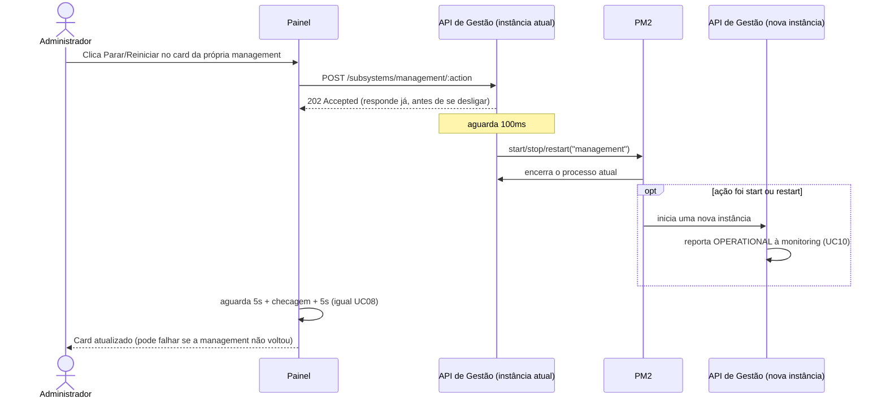
```mermaid
sequenceDiagram
    actor Adm as Administrador
    participant Web as Painel
    participant Mgmt as API de Gestão (instância atual)
    participant PM2 as PM2
    participant Nova as API de Gestão (nova instância)

    Adm->>Web: Clica Parar/Reiniciar no card da própria management
    Web->>Mgmt: POST /subsystems/management/:action
    Mgmt-->>Web: 202 Accepted (responde já, antes de se desligar)
    Note over Mgmt: aguarda 100ms
    Mgmt->>PM2: start/stop/restart("management")
    PM2->>Mgmt: encerra o processo atual
    opt ação foi start ou restart
        PM2->>Nova: inicia uma nova instância
        Nova->>Nova: reporta OPERATIONAL à monitoring (UC10)
    end
    Web->>Web: aguarda 5s + checagem + 5s (igual UC08)
    Web-->>Adm: Card atualizado (pode falhar se a management não voltou)
```

#### UC10 — Reportar o próprio status

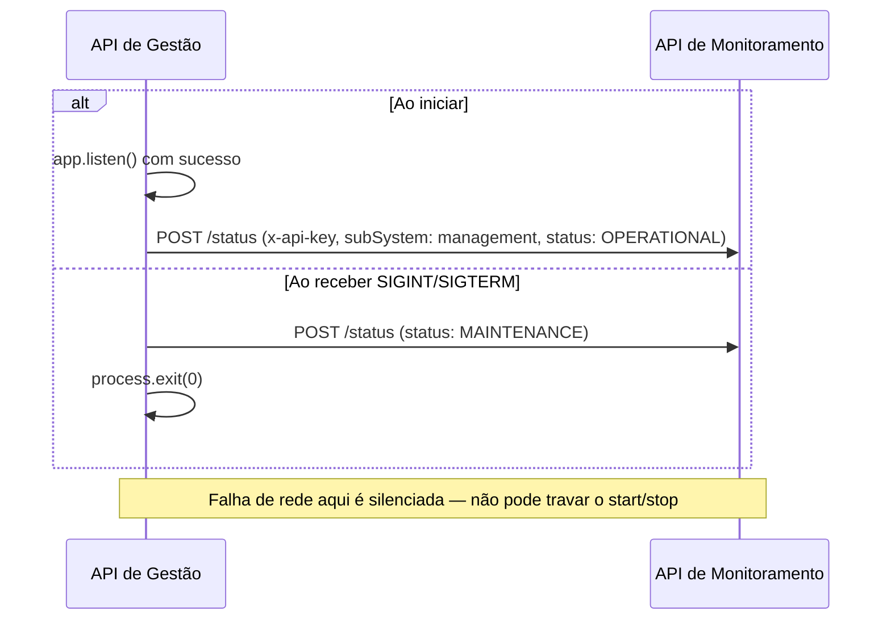
```mermaid
sequenceDiagram
    participant Mgmt as API de Gestão
    participant Mon as API de Monitoramento

    alt Ao iniciar
        Mgmt->>Mgmt: app.listen() com sucesso
        Mgmt->>Mon: POST /status (x-api-key, subSystem: management, status: OPERATIONAL)
    else Ao receber SIGINT/SIGTERM
        Mgmt->>Mon: POST /status (status: MAINTENANCE)
        Mgmt->>Mgmt: process.exit(0)
    end
    Note over Mgmt,Mon: Falha de rede aqui é silenciada — não pode travar o start/stop
```

#### UC11 — Subir o ambiente completo

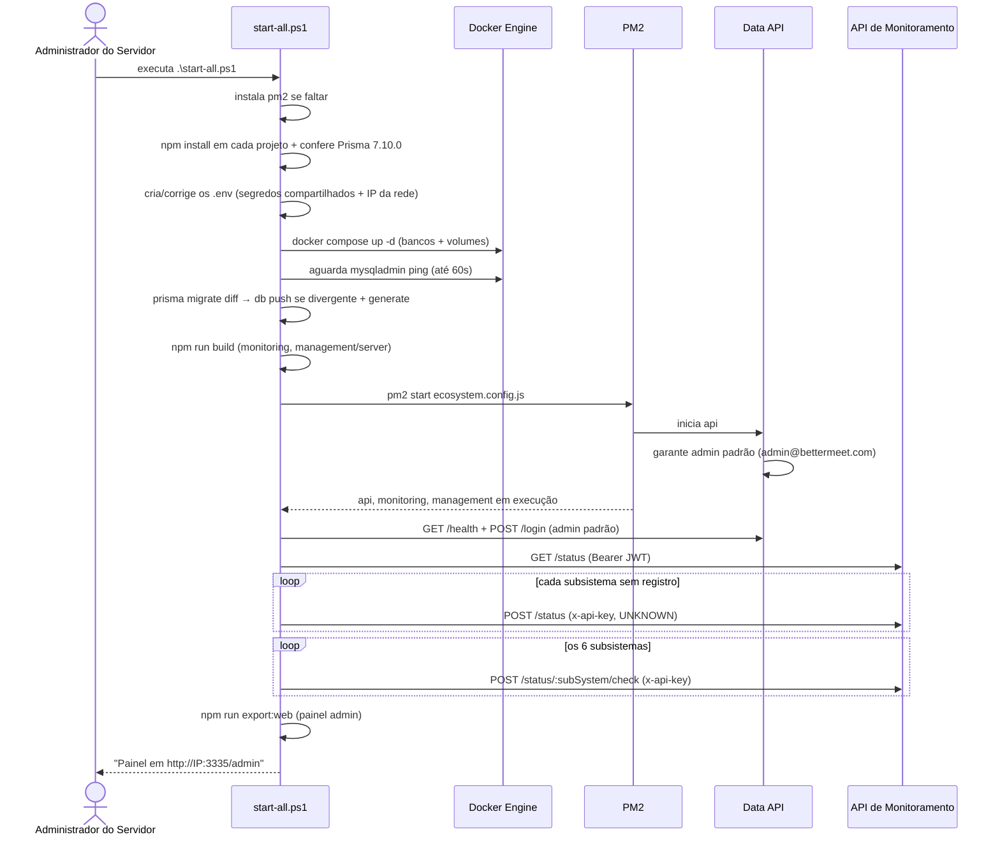
```mermaid
sequenceDiagram
    actor Adm as Administrador do Servidor
    participant Script as start-all.ps1
    participant Docker as Docker Engine
    participant PM2 as PM2
    participant Api as Data API
    participant Mon as API de Monitoramento

    Adm->>Script: executa .\start-all.ps1
    Script->>Script: instala pm2 se faltar
    Script->>Script: npm install em cada projeto + confere Prisma 7.10.0
    Script->>Script: cria/corrige os .env (segredos compartilhados + IP da rede)
    Script->>Docker: docker compose up -d (bancos + volumes)
    Script->>Docker: aguarda mysqladmin ping (até 60s)
    Script->>Script: prisma migrate diff → db push se divergente + generate
    Script->>Script: npm run build (monitoring, management/server)
    Script->>PM2: pm2 start ecosystem.config.js
    PM2->>Api: inicia api
    Api->>Api: garante admin padrão (admin@bettermeet.com)
    PM2-->>Script: api, monitoring, management em execução
    Script->>Api: GET /health + POST /login (admin padrão)
    Script->>Mon: GET /status (Bearer JWT)
    loop cada subsistema sem registro
        Script->>Mon: POST /status (x-api-key, UNKNOWN)
    end
    loop os 6 subsistemas
        Script->>Mon: POST /status/:subSystem/check (x-api-key)
    end
    Script->>Script: npm run export:web (painel admin)
    Script-->>Adm: "Painel em http://IP:3335/admin"
```

#### UC12 — Resetar o sistema

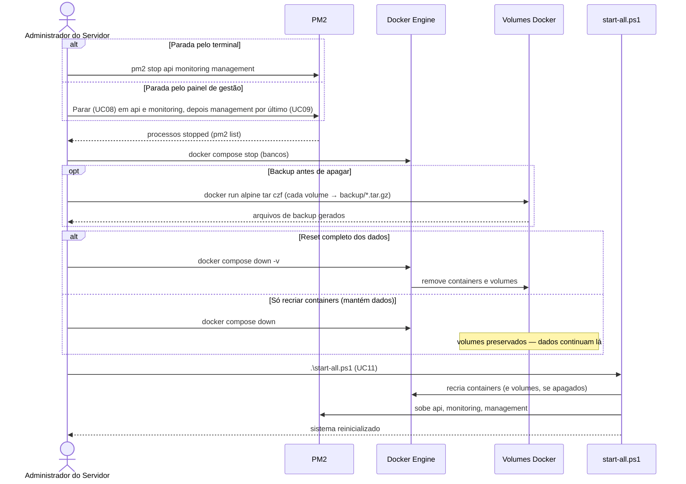
```mermaid
sequenceDiagram
    actor Adm as Administrador do Servidor
    participant PM2 as PM2
    participant Docker as Docker Engine
    participant Vol as Volumes Docker
    participant Script as start-all.ps1

    alt Parada pelo terminal
        Adm->>PM2: pm2 stop api monitoring management
    else Parada pelo painel de gestão
        Adm->>PM2: Parar (UC08) em api e monitoring, depois management por último (UC09)
    end
    PM2-->>Adm: processos stopped (pm2 list)
    Adm->>Docker: docker compose stop (bancos)

    opt Backup antes de apagar
        Adm->>Vol: docker run alpine tar czf (cada volume → backup/*.tar.gz)
        Vol-->>Adm: arquivos de backup gerados
    end

    alt Reset completo dos dados
        Adm->>Docker: docker compose down -v
        Docker->>Vol: remove containers e volumes
    else Só recriar containers (mantém dados)
        Adm->>Docker: docker compose down
        Note over Vol: volumes preservados — dados continuam lá
    end

    Adm->>Script: .\start-all.ps1 (UC11)
    Script->>Docker: recria containers (e volumes, se apagados)
    Script->>PM2: sobe api, monitoring, management
    Script-->>Adm: sistema reinicializado
```

### Requisitos Não Funcionais

| Código | Requisito | Descrição |
|---|---|---|
| RNF21 | Whitelist fixa de subsistemas controláveis | Nenhum nome vindo do `body`/`params` pode virar comando arbitrário pro PM2 ou Docker — só os nomes conhecidos (`api`, `monitoring`, `management`, `database`, `monitoring-database`) são aceitos |
| RNF22 | Autorização por papel | Toda ação de start/stop/restart exige token JWT válido **e** `role: ADMIN`; um usuário comum autenticado recebe `403` mesmo com token válido |
| RNF23 | Resposta antes de efeito colateral irreversível | Ao agir sobre si mesma, a API de Gestão responde `202` antes de disparar o comando de restart/stop, evitando deixar a conexão HTTP pendente indefinidamente |
| RNF24 | Ausência de banco de dados próprio | A API de Gestão não mantém estado persistente próprio (sem schema/tabelas); autenticação é validada via JWT compartilhado com a Data API, e status é delegado à API de Monitoramento — reduz pontos únicos de falha adicionais |
| RNF25 | Portabilidade do acesso ao Docker | A conexão com o Docker Engine detecta automaticamente o sistema operacional (named pipe no Windows, socket Unix no Linux), sem configuração manual |
| RNF26 | Tecnologia | API REST em Node.js + TypeScript + Express; comunicação com PM2 via API programática (pacote `pm2`) e com Docker via `dockerode`; painel administrativo em React Native Web (Expo), servido como build estático pela própria API de Gestão em `/admin` |
| RNF27 | Setup idempotente | O script de setup (`start-all.ps1`) deve poder ser executado repetidas vezes sem duplicar containers, sem sobrescrever segredos já válidos nos `.env` e sem alterar o banco quando o schema já estiver em sincronia |
| RNF28 | Segredos compartilhados consistentes | `JWT_SECRET` e a chave de API interna devem ter um único valor, gerado aleatoriamente (32 bytes) e replicado em todos os projetos que os usam — nunca um valor diferente por arquivo |
| RNF29 | Reset destrutivo apenas manual | Não deve existir endpoint ou botão que apague os dados do sistema; o reset completo exige acesso ao servidor e a remoção explícita dos volumes (`docker compose down -v`), evitando perda de dados por acidente ou por um token comprometido |
| RNF30 | Persistência e backup via volumes | Os dados dos dois bancos devem ficar em volumes Docker nomeados (`db_better_meet_data`, `db_monitoring_better_meet_data`), independentes do ciclo de vida dos containers, permitindo recriar containers sem perda de dados e fazer backup/restauração copiando o conteúdo dos volumes |

---

## Informações do Sistema — Relatórios de Usuários, Organizações e Comissões (Data API + App Mobile)

> Cobre a parte de **relatórios de usuários/organizações/comissões** do requisito "Informações do sistema" (slide 9). Os relatórios são calculados sob demanda pela Data API (`api`), a partir das tabelas já existentes (`User`, `Organizacao`, `OrganizacaoMembro`, `Comissao`, `ComissaoEquipe`) — não há tabela própria de relatório. São exibidos na tela "Relatórios" do app mobile (`better-meet/src/app/relatorios.tsx`), acessível pelo menu lateral para qualquer usuário autenticado, com abas: **Organizações** e **Comissões** para todos, e **Usuários** apenas para administradores.

### Atores

| Ator | Tipo | Descrição |
|---|---|---|
| Usuário Autenticado | Humano (abstrato) | Generaliza os dois atores abaixo — qualquer um com JWT válido acessa a tela de Relatórios |
| Usuário (membro) | Humano | Usuário com `role: USER`; vê os relatórios **restritos** às organizações e comissões das quais participa |
| Administrador | Humano | Usuário com `role: ADMIN`; vê os relatórios **globais** de todas as organizações e comissões e o relatório de usuários da plataforma |

### Diagrama de Casos de Uso

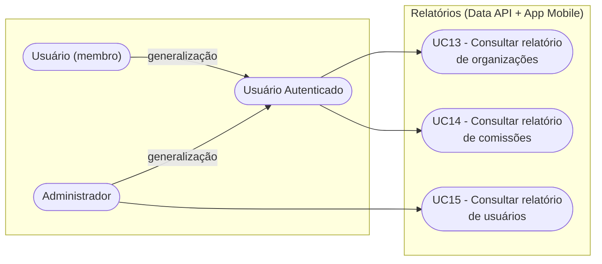
```mermaid
flowchart LR
    subgraph Atores[ ]
        direction TB
        AU(["Usuário Autenticado"])
        AUs(["Usuário (membro)"])
        AAdm(["Administrador"])

        AUs -- generalização --> AU
        AAdm -- generalização --> AU
    end

    subgraph SistemaRel["Relatórios (Data API + App Mobile)"]
        UC13(["UC13 - Consultar relatório<br/>de organizações"])
        UC14(["UC14 - Consultar relatório<br/>de comissões"])
        UC15(["UC15 - Consultar relatório<br/>de usuários"])
    end

    AU --> UC13
    AU --> UC14
    AAdm --> UC15
```

### Descrição dos Casos de Uso

#### UC13 — Consultar relatório de organizações

| Campo | Descrição |
|---|---|
| **Ator(es)** | Usuário (membro), Administrador |
| **Descrição** | Permite visualizar indicadores agregados das organizações: total, quantidade por status, crescimento mensal, distribuição de papéis dos membros e média de membros por organização, com a lista das organizações consideradas |
| **Pré-condições** | Ator autenticado (JWT válido obtido no `/login`) |
| **Fluxo Principal** | 1. Ator abre "Relatórios" no menu lateral (aba "Organizações", padrão). 2. App envia, em paralelo, o pedido do relatório e da lista: se Administrador, `GET /organizacoes/relatorio` e `GET /organizacoes`; se membro, `GET /organizacoes/relatorio/minhas` e `GET /organizacoes/minhas` — todos com `Authorization: Bearer <token>`. 3. Data API valida o token (e o papel `ADMIN`, nas rotas globais). 4. Data API busca as organizações (todas, ou só aquelas em que o usuário é membro) com os papéis dos membros. 5. Data API calcula: `total`; `porStatus` (`PENDENTE`, `ACEITA`, `RECUSADA`); `crescimentoPorMes` (organizações criadas em cada um dos últimos 12 meses, incluindo meses zerados); `distribuicaoPapeis` (`CRIADOR`, `GERENTE`, `MODERADOR`, `MEMBRO`) e `mediaMembrosPorOrganizacao`, esses dois considerando apenas organizações `ACEITA`. 6. Data API retorna `200 OK` com o relatório; o app exibe os indicadores e a lista. |
| **Fluxos Alternativos / Exceção** | 3a. Token ausente ou inválido → `401 Unauthorized`. 3b. Usuário comum chamando a rota global → `403 Forbidden` (o app sempre escolhe a rota conforme o papel, então isso só ocorre em chamada direta à API). 4a. Membro sem nenhuma organização → relatório com `total: 0` e contadores zerados. 6a. Falha em um dos relatórios → mensagem de erro exibida só naquela aba; as demais abas continuam carregando normalmente. |
| **Pós-condições** | Ator visualiza os indicadores das organizações às quais tem acesso. O relatório é recarregado sempre que a tela volta a ficar em foco (ex.: depois de aprovar uma organização em outra tela) |

#### UC14 — Consultar relatório de comissões

| Campo | Descrição |
|---|---|
| **Ator(es)** | Usuário (membro), Administrador |
| **Descrição** | Permite visualizar indicadores agregados das comissões: total, quantidade por organização, crescimento mensal, distribuição de papéis na equipe e média de membros por comissão, com a lista das comissões para detalhamento |
| **Pré-condições** | Ator autenticado (JWT válido) |
| **Fluxo Principal** | 1. Ator seleciona a aba "Comissões" na tela de Relatórios. 2. App envia `GET /api/comissoes/relatorio` (Administrador) ou `GET /api/comissoes/relatorio/minhas` (membro), com Bearer token. 3. Data API valida o token (e o papel `ADMIN`, na rota global). 4. Data API busca as comissões (todas, ou só aquelas em cuja equipe o usuário está), com a organização e os papéis da equipe. 5. Data API calcula: `total`; `totalOrganizacoes`; `porOrganizacao` (ordenado da maior para a menor quantidade); `crescimentoPorMes` (últimos 12 meses); `distribuicaoPapeis` (`ADMINISTRADOR`, `FACILITADOR`, `SECRETARIO`, `MEMBRO`); `mediaMembrosPorComissao`; e a lista `comissoes` (id, nome, descrição, data de criação, organização e número de membros), da mais recente para a mais antiga. 6. Data API retorna `200 OK`; o app exibe os indicadores e a lista. |
| **Fluxos Alternativos / Exceção** | 3a. Token ausente ou inválido → `401 Unauthorized`. 3b. Usuário comum chamando a rota global → `403 Forbidden`. 4a. Usuário sem nenhuma comissão → relatório com `total: 0` e lista vazia. 6a. Falha → mensagem de erro exibida só nesta aba. |
| **Pós-condições** | Ator visualiza os indicadores das comissões às quais tem acesso |

#### UC15 — Consultar relatório de usuários

| Campo | Descrição |
|---|---|
| **Ator(es)** | Administrador |
| **Descrição** | Permite ao administrador visualizar indicadores sobre todos os usuários da plataforma: total, quantidade por papel, crescimento mensal, engajamento em organizações/comissões, papéis de responsabilidade, ranking dos mais ativos, tema preferido e a lista detalhada de usuários com seus vínculos |
| **Pré-condições** | Ator autenticado com `role: ADMIN` |
| **Fluxo Principal** | 1. Administrador seleciona a aba "Usuários" na tela de Relatórios (a aba só aparece para administradores). 2. App envia `GET /usuarios/relatorio` com Bearer token. 3. Data API valida o token e exige `role: ADMIN`. 4. Data API busca todos os usuários com seus vínculos de organização e comissão. 5. Data API calcula: `total`; `porRole` (`ADMIN`, `USER`); `crescimentoPorMes` (últimos 12 meses); `engajamento` (usuários com e sem organização, com comissão, e média de organizações e de comissões por usuário); `usuariosPorPapelOrganizacao` (`CRIADOR`, `GERENTE`, `MODERADOR`) e `usuariosPorPapelComissao` (`ADMINISTRADOR`, `FACILITADOR`, `SECRETARIO`), contando cada usuário uma vez por papel; `maisAtivos` (5 usuários com mais vínculos); `porTema` (`light`, `dark`, `system` — preferência nula conta como `system`); e a lista `usuarios` (id, nome, e-mail, papel, data de cadastro, organizações e comissões com o papel em cada uma). 6. Data API retorna `200 OK`; o app exibe os indicadores e a lista. |
| **Fluxos Alternativos / Exceção** | 1a. Usuário comum → a aba não é exibida e a requisição não é feita. 3a. Token ausente ou inválido → `401 Unauthorized`. 3b. Usuário sem papel `ADMIN` chamando a rota diretamente → `403 Forbidden`. 5a. Erro inesperado → `500` com "Não foi possível gerar o relatório de usuários."; mensagem exibida só nesta aba. |
| **Pós-condições** | Administrador visualiza os indicadores de usuários da plataforma |

### Diagramas de Sequência

#### UC13 — Consultar relatório de organizações

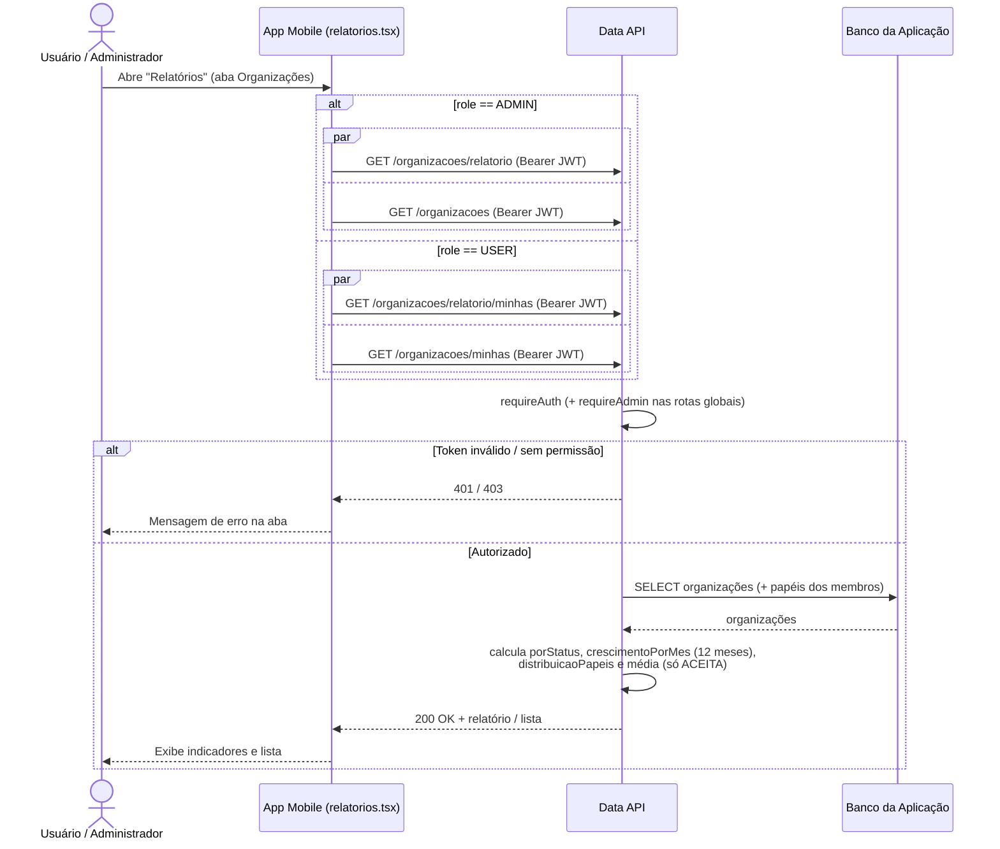
```mermaid
sequenceDiagram
    actor U as Usuário / Administrador
    participant App as App Mobile (relatorios.tsx)
    participant Api as Data API
    participant DB as Banco da Aplicação

    U->>App: Abre "Relatórios" (aba Organizações)
    alt role == ADMIN
        par
            App->>Api: GET /organizacoes/relatorio (Bearer JWT)
        and
            App->>Api: GET /organizacoes (Bearer JWT)
        end
    else role == USER
        par
            App->>Api: GET /organizacoes/relatorio/minhas (Bearer JWT)
        and
            App->>Api: GET /organizacoes/minhas (Bearer JWT)
        end
    end
    Api->>Api: requireAuth (+ requireAdmin nas rotas globais)
    alt Token inválido / sem permissão
        Api-->>App: 401 / 403
        App-->>U: Mensagem de erro na aba
    else Autorizado
        Api->>DB: SELECT organizações (+ papéis dos membros)
        DB-->>Api: organizações
        Api->>Api: calcula porStatus, crescimentoPorMes (12 meses),<br/>distribuicaoPapeis e média (só ACEITA)
        Api-->>App: 200 OK + relatório / lista
        App-->>U: Exibe indicadores e lista
    end
```

#### UC14 — Consultar relatório de comissões

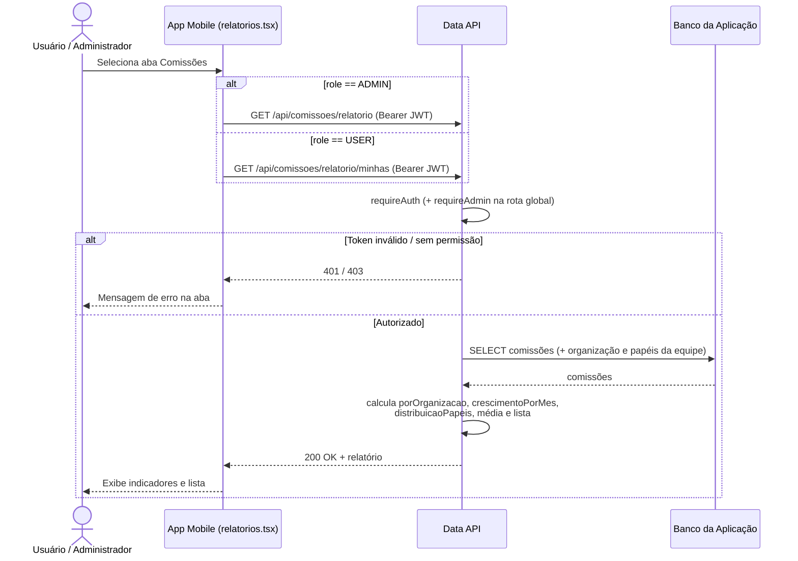
```mermaid
sequenceDiagram
    actor U as Usuário / Administrador
    participant App as App Mobile (relatorios.tsx)
    participant Api as Data API
    participant DB as Banco da Aplicação

    U->>App: Seleciona aba Comissões
    alt role == ADMIN
        App->>Api: GET /api/comissoes/relatorio (Bearer JWT)
    else role == USER
        App->>Api: GET /api/comissoes/relatorio/minhas (Bearer JWT)
    end
    Api->>Api: requireAuth (+ requireAdmin na rota global)
    alt Token inválido / sem permissão
        Api-->>App: 401 / 403
        App-->>U: Mensagem de erro na aba
    else Autorizado
        Api->>DB: SELECT comissões (+ organização e papéis da equipe)
        DB-->>Api: comissões
        Api->>Api: calcula porOrganizacao, crescimentoPorMes,<br/>distribuicaoPapeis, média e lista
        Api-->>App: 200 OK + relatório
        App-->>U: Exibe indicadores e lista
    end
```

#### UC15 — Consultar relatório de usuários

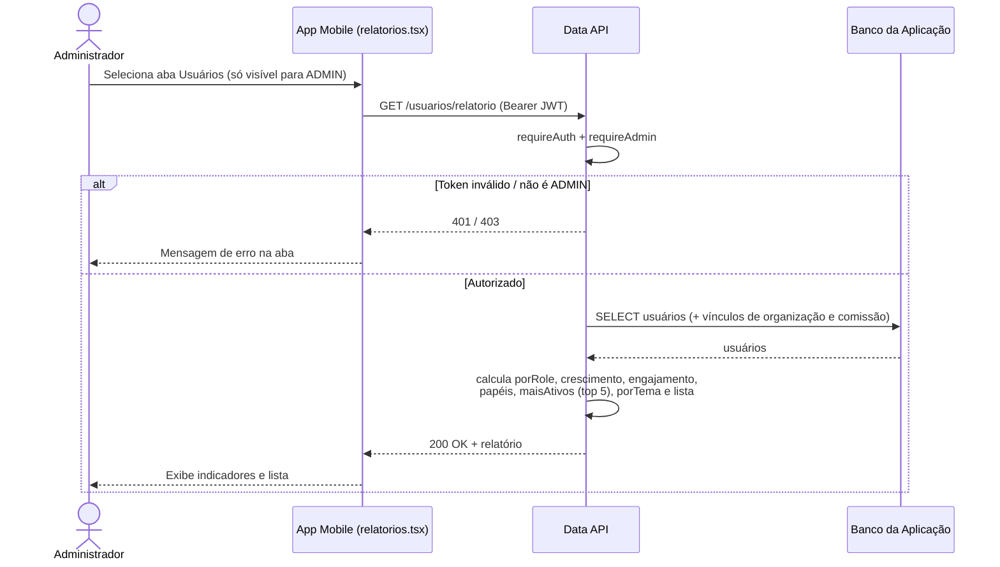
```mermaid
sequenceDiagram
    actor Adm as Administrador
    participant App as App Mobile (relatorios.tsx)
    participant Api as Data API
    participant DB as Banco da Aplicação

    Adm->>App: Seleciona aba Usuários (só visível para ADMIN)
    App->>Api: GET /usuarios/relatorio (Bearer JWT)
    Api->>Api: requireAuth + requireAdmin
    alt Token inválido / não é ADMIN
        Api-->>App: 401 / 403
        App-->>Adm: Mensagem de erro na aba
    else Autorizado
        Api->>DB: SELECT usuários (+ vínculos de organização e comissão)
        DB-->>Api: usuários
        Api->>Api: calcula porRole, crescimento, engajamento,<br/>papéis, maisAtivos (top 5), porTema e lista
        Api-->>App: 200 OK + relatório
        App-->>Adm: Exibe indicadores e lista
    end
```

### Requisitos Não Funcionais

| Código | Requisito | Descrição |
|---|---|---|
| RNF31 | Escopo do relatório conforme o papel | Administradores veem relatórios globais; usuários comuns veem apenas dados das organizações e comissões das quais participam. As rotas globais exigem `role: ADMIN` no servidor (`403` caso contrário), independentemente do que o app exibe |
| RNF32 | Proteção de dados pessoais no relatório de usuários | O relatório de usuários expõe dados de outras pessoas (nome, e-mail, vínculos) e deve ser acessível somente por administradores, tanto na interface (aba oculta) quanto na API (`requireAdmin`) |
| RNF33 | Relatórios calculados sob demanda | Os relatórios devem ser calculados a partir dos dados atuais a cada requisição, sem tabelas de agregação ou cache, garantindo que reflitam imediatamente mudanças como aprovação de organizações ou alteração de equipe |
| RNF34 | Isolamento de falhas entre relatórios | A falha no carregamento de um relatório não pode impedir a exibição dos demais — cada aba carrega de forma independente e mostra seu próprio erro |
| RNF35 | Série temporal completa | O crescimento mensal deve sempre apresentar os últimos 12 meses, incluindo meses sem registros (valor 0), para que os gráficos não tenham lacunas |

---

## Cadastro de Organização (Data API)

> Diagrama de casos de uso convertido a partir de `Diagramas/DCU - Organização.asta` (Astah), unificado com o restante do documento a pedido do professor — a exportação em PNG já existente (`Diagramas/DCU - Organizações.png`) foi usada como referência exata pro conteúdo (o `.asta` em si é um binário Java serializado dentro de um ZIP, não abre como texto). O diagrama de classes correspondente está em `dicionario_de_dados.md`, seção "Cadastro de Organização, Comissão e Usuário".
>
> **Escopo desta seção**: só o diagrama de casos de uso foi convertido, que é o que existia no Astah. A descrição de cada caso de uso no formulário padrão, os diagramas de sequência e os requisitos não funcionais deste requisito ainda precisam ser preenchidos por quem o levantou — segue a mesma estrutura das seções acima quando isso for feito.

### Atores

| Ator | Tipo | Descrição |
|---|---|---|
| Usuário | Humano | Qualquer usuário cadastrado; pode solicitar a criação de uma organização |
| Administrador | Humano | Generaliza `Usuário` (todo Administrador também é um Usuário); único que aprova/recusa organizações e as gerencia |

### Diagrama de Casos de Uso

```mermaid
flowchart LR
    subgraph Atores[ ]
        direction TB
        AUs(["Usuário"])
        AAdm(["Administrador"])

        AAdm -- generalização --> AUs
    end

    subgraph SistemaOrg["Cadastro de Organização (Data API)"]
        UCa(["Solicita criação de<br/>nova organização"])
        UCb(["Autorizar/Revogar<br/>organização"])
        UCc(["Gerenciar<br/>organizações"])
    end

    AUs --> UCa
    AAdm --> UCb
    AAdm --> UCc
```
